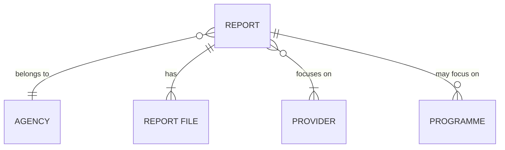
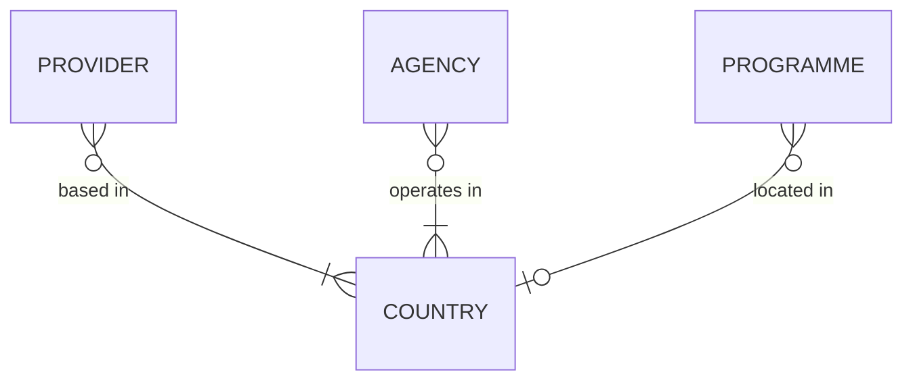
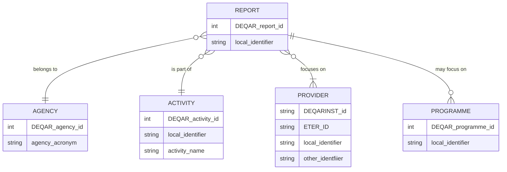

# Architecture and Data Model

Structural Overview
-------------------
The DEQAR data model has been designed around four main entities: registered quality assurance **agencies**, higher education **providers**, their educational **programmes**, and external quality assurance **Reports**.

Registered agency users are invited to submit and manage information on external quality assurance reports, including information about the particular programme described in the report, if applicable.

Information on higher education providers is managed by the EQAR Secretariat. The information on higher education institutions is largely based on data from ETER/OrgReg. The information on other providers is provided by QA agencies and managed by the EQAR Secretariat.

EQAR continues to collect and manage agency data, through its register, as well as country data in its knowledge base. These will be linked to report and provider data in DEQAR. To support this, DEQAR also includes a **country** entity, which contains information on the official external quality assurance regime in the countries/higher education systems of the European Higher Education Area (EHEA).

Functional Overview
-------------------
DEQAR supports three core activities:

- **Submission of data objects:** agencies submit objects and PDF files, meeting defined criteria, using one of three methods:

    - as [individual records via webform](data_submission.md#webform)
    - as [batch CSV file via webform](data_submission.md#csv-upload)
    - as [JSON using an API](data_submission.md#submission-api)
    
- **Administration of records:** data is ingested and records are created, stored and managed by EQAR staff and agencies over the longer term. Agencies may update report records already in the system and track their own activity.

- **Search and discovery of information:** records are published on a [public web interface](https://www.deqar.eu/) for search, retrieval and export or download by end users. There is also a [public API](web_api_intro.md) available to all registered users; this allows users to embed DEQAR search interface in their local site.

Role of Standards and Identifiers 
---------------------------------

As DEQAR aggregates data from different sources, several challenges are faced:

1. to keep the same data from different sources synchronised (e.g. the same provider may be described differently by different agencies);
2. to try to avoid duplication;
3. to identify already existing records for update if necessary.

DEQAR uses a set of standard identifiers, which are provided by the system for each object.  In several cases, agencies are able to provide their local or national identifiers for objects in order to ease their internal workflows. Objects are identified in the following ways:

| Object      | Recommended Identification | Alternative Identification |
| ----------- | -------------------------- | -------------------------- |
| Agency      | DEQAR Agency ID            | agency acronym             |
| Activity    | DEQAR Activity ID          | activity local identifier, activity name |
| Reports     | local report identifier    | DEQAR Report ID            |
| Provider    | DEQARINST ID               | ETER ID, local identifier, other identifier |
| Programme   | local programme identifier |                            |

As a rule, objects already in the system should be identified to facilitate linking up. In other words:

1. The **agency responsible** for the report and the **activity** to which it belongs *must be identified with any submission*.
2. An identifier must be provided for each **provider** (higher education institution or other provider) covered by the report. If provider records do not yet exist in DEQAR, information on them [must be provided separately](institution_data.md#how-to-provide-data) before reports can be submitted.
3. In the case of **reports** and **programmes**, agencies are encouraged to provide local identifiers with each new submission of data in order to facilitate subsequent linking:

    - For reports, the agency can provide a local identifier with each new report submitted; the local identifier may be used to later update the report using CSV or JSON and may also help each agency to synchronise its local system with DEQAR.
    - For programmes, the first time an agency provides information on a programme to DEQAR, a local (or national) identifier can be submitted along with data on the programme; the identifier can later be used by the agency for any report on the same programme.

The identification of each type of object is explained in detail below.

### Agency Identifiers

Authentication is required before the submission and update of data and files. Thus, the agency responsible for each report can be identified automatically by the system. In some cases, an agency may serve as a *proxy agency* for a *creating agency*, submitting and managing data on its behalf (as in the case of umbrella organisations). In this case, the creating agency’s unique acronym or DEQAR Agency ID (which can be found in the administrative interface) must be provided as the source of identification. For this reason, identification of the creating agency is required for each object when using CSV and JSON.

(See [Submission Object Data Elements: Agency](report_data.md#agency).)

### Activity Identifiers

DEQAR also assigns IDs to each agency's activities (see list on the agency's [public register entry](https://www.eqar.eu/register/agencies/) under *Activities within the scope of ESG*). These identifiers, which can be found through the administrative interface, should be used to indicate the type of report in each CSV or JSON object. Alternatively, the exact name of the activity can be used or an agency may wish to use its own local activity identifiers; in this case, the agency should supply through their local identifiers through the administrative interface before using them for submission.

*Note: Only one identifier should be provided for the assigned activity.*

Please note that any changes to the agency's activities, other than purely editorial or technical changes, must be made through [Substantive Change Reports](https://www.eqar.eu/register/reporting-and-renewal/).

(See [Submission Object Data Elements: Activity](report_data.md#activity).)

### Report Identifiers

We strongly recommend that agencies provide a local identifier with each report submitted. This will allow for subsequent updates to the record and will ease synchronisation with each agency's local system. Report local identifiers will be stored and can serve to identify records for update/resubmission. DEQAR will also automatically generate a DEQAR ID for each newly submitted report; this will be returned to agencies as part of the response object. The DEQAR ID can be used for updates/resubmission as an alternative to local identifiers.

(See [Submission Object Data Elements: Report Identifier](report_data.md#report-identifier).)

### Provider Identifiers

Providers already described in DEQAR should be identified in report submissions using one of several identifiers. This allows the system to automatically link report data to existing institution records.

- **DEQARINST IDs**: DEQAR automatically generates a so-called "DEQARINST ID" for each provider record that is created in the system. These can be found through the administrative interface. (They are also returned to the agency as part of the response object after each successful submission.) Ideally, each registered agency will store the DEQARINST IDs for providers treated in their reports. These are recommended for use in each submission.
    
- **ETER IDs**: DEQAR creates and updates records on higher education institutions from many European countries from the ETER/OrgReg database every 24&nbsp;hours. The ETER ID for these institutions can be found through the administrative interface. The ETER IDs may be stored and used by agencies for submission as an alternative to the DEQARINST IDs.
    
- **Local identifiers**: Agencies may also create and store local identifiers for providers. These can be used for submission as an alternative to the DEQARINST IDs if supplied in advance. Each agency can provide these individually through the administrative interface or these can provided in bulk to the EQAR Secretariat. Local identifiers are managed by one agency independently and can only be used by that agency.

- **Other identifiers**: DEQAR allows to store additional national, European or other identifiers. These can be used for submission as an alternative to the DEQARINST IDs and are available to all agencies; other identifiers available in the system can be consulted through the administrative interface. In order to ensure uniqueness and stability these are managed by the EQAR secretariat, but agencies are invited to provide identifiers to EQAR that might be useful to other agencies.

    Other identifiers are always used in combination with a resource indication, denoting the type of identifier, in combination with which they are unique. EQAR maintains a background list of [other trusted identifiers](institution_data.md#identifier). Agencies and other stakeholders can contact EQAR if they want to provide other identifiers.

> *Note:* If an agency cannot locate an existing provider record in DEQAR (and therefore cannot provide either the DEQARINST ID, ETER ID or local identifier), then it will need to provide data separately before being able to submit reports on that provider.

(See [Provider Data](institution_data.md) and [Submission Object Data Elements: Provider(s)](report_data.md#institutions).)

### Programme Identifiers

DEQAR will not synchronise data on programmes; however, if a local or national identifier is provided at the time of submission, this will be stored in the system. The agency can use the programme identifier if it would like to simply re-use the existing programme data for subsequent reports. It is thus recommended to provide a unique programme identifier if available.

(See [Submission Object Data Elements: Programme Identification](report_data.md#programme-identification).)

### Other Identifiers and Codes

**Countries** are identified via the [ISO 3166-1 standard](https://en.wikipedia.org/wiki/ISO_3166-1). Both two-letter (alpha-2) or three-letter (alpha-3) codes can be used.

As some EHEA countries consist of several sub-national higher education systems with separate legislation on higher education, those sub-systems are represented as distinct “countries” in DEQAR to provide accurate system-level information. Sub-national systems have no alpha-3 code assigned but can be identified by the following non-standard extended alpha-2 codes:

| Code   | Country        | Sub-system                |
| ------ | -------------- | ------------------------- |
| BE-fl  | Belgium        | Flemish Community         |
| BE-fr  | Belgium        | French Community          |
| BE-de  | Belgium        | German-speaking Community |
| UK-ENG | United Kingdom | England                   |
| UK-SCT | United Kingdom | Scotland                  |
| UK-WLS | United Kingdom | Wales                     |
| UK-NIR | United Kingdom | Northern Ireland          |

**Language** codes are accepted in [ISO 639-1 or ISO 639-2/B format](https://en.wikipedia.org/wiki/List_of_ISO_639-1_codes).

Finally, DEQAR provides DEQAR IDs for standard values used for **Report Status** and **Report Decision**. These can be provided instead of the equivalent string values in CSV or JSON objects.

(See [Submission Object Data Elements: Report Details](report_data.md#details).)

Building Provider Records
-------------------------

DEQAR has two basic workflows for creating and updating provider records:

1. records on *higher education institutions from most European countries* are created and updated from the ETER/OrgReg databases (available through [Research infrastructure for research and innovation policy studies - RISIS](https://www.risis2.eu/registers-orgreg/) or [European Tertiary Education Register - ETER](https://www.eter-project.com/);
2. records on *higher education institutions located in countries not covered by ETER/OrgReg* and records on *other providers* are created from scratch based on data submitted by an agency.

### Use of Data from ETER/OrgReg

The [European Tertiary Education Register (ETER)](https://eter-project.com/) is a European-level database providing data on higher education institutions' (HEI) activities and outputs. ETER collects data from national statistics authorities and ministries in charge of higher education matters in Europe. Linked to ETER, the [Register of Public Sector Organisations (OrgReg)](https://www.risis2.eu/registers-orgreg/) provides a reference list of higher education institutions in all EU Member States, EEA-EFTA countries (Iceland, Liechtenstein, Norway and Switzerland), candidate countries (Albania, Bosnia and Hercegovina, Kosovo, Montenegro, North Macdeonia, Serbia and Turkey) as well as the United Kingdom.

DEQAR updates records from ETER/OrgReg every 24&nbsp;hours. These records serve as base set of records on European higher education institutions in DEQAR. DEQAR stores the following ETER data on institutions:

- ETER ID
- official name
- English name
- acronym
- country
- city (when available)
- latitude/longitude (when available)
- QF-EHEA levels
- institution website

ETER/OrgReg data is managed according to the following principles:

1. DEQAR uses ETER/OrgReg data as a “single source of truth”.
2. If an agency would like to propose a correction or change of ETER/OrgReg-based data, the EQAR secretariat should be contacted. After reviewing, the EQAR Secretariat will make these changes in OrgReg and they will be reflected in DEQAR automatically afterwards.
3. Alternative names and local identifiers may be added to ETER-based records and managed by agencies through the administrative interface (see [Institution Identifiers](#institution-identifiers) above).
5. Added information and updates in ETER/OrgReg are carried through to records in DEQAR from the next daily update.

### Providers Not in ETER/OrgReg

For data not existing in ETER/OrgReg, a new record must be created based on data submitted by an agency. In the majority of cases these providers will be higher education institutions which are either based in countries not covered by ETER/OrgReg or other providers.

In order to ensure data quality and avoid record duplication, provider data is always manually screened by EQAR staff and thus needs to be submitted separately and before reports are uploaded for an institution. The minimum data needed to create a record is: name official, country of institution and website (the URL of domain).

Provider data is managed as follows in this case:

1. As a general policy, DEQAR keeps provider data, including that submitted directly by an agency, stable and unchanged.
2. If an agency would like to propose a correction or change of data for more than 5 providers,  we are inviting agencies to add the information on the changes in the tab “Update institutions” or “Update other providers” in the templates [available here](institution_data.md#how-to-provide-data) respectively and send it to <deqar@eqar.eu>. For changes of data on less than 5 providers, please contact the EQAR secretariat with a description of the change (i.e. a new name, closure date of the provider, new website etc.) at the above mentioned email address.
3. Local identifiers may be added to any provider record and managed by agencies through the administrative interface (see [Provider Identifiers](#provider-identifiers) above).
4. The EQAR Secretariat reserves the right to adapt records based on the information that we receive through agencies and other sources.

(See [Provider Data Elements](institution_data.md#institution-data-elements).)

### Hierarchical and Historical Provider Relationships

In those cases that **quality assurance reports are produced for different organisational levels of a provider**, DEQAR collects and stores data on both entities and establishes a hierarchical link between them. This may be the case of a higher education institution and its "child" faculties, or of a provider and its "parent" group. Another example could be that a university founds an alternative provider through which it organises labour market focused short courses.

In the public search interface, quality assurance reports produced for different levels in the same provider will *cascade* -- i.e. records on child providers will include the reports produced on the parents; records on parent providers will show the reports produced on its children.

For higher education institutions, DEQAR bases its hierarchical links on information taken from ETER/OrgReg. If any agency would like to propose an additional structural link between two or more providers or institutional levels, then the proposed link can be provided individually or in a longer list to the EQAR secretariat.

Please bear in mind that the main higher education institution unit is the university and that EQAR encourages agencies to upload reports under the university’s record rather than the smaller units. More on the definition of higher education institutions can be found under [defining institutions](institution_data.md#defining-higher-education-institutions).

DEQAR also stores information on **historical changes in the structure of providers, e.g. mergers, splits, spin offs and absorptions**. This allows users to view historical records in the correct context. It will also facilitate the search and discovery of current providers.

*Note: historical changes in the structure of agencies will also be stored and presented online.*

Presenting Historical Data
--------------------------

DEQAR not only presents information on the recent ESG-compliant quality assurance activities, but also records an historical "trail" of the these activities since 2008, a date which marked the launch of EQAR. Thus DEQAR stores both current and past valid reports on each provider and both are presented to end users through the search interface. Historical data is especially important for DEQAR users from recognition offices or information centres.

> Agencies should thus upload information on all external QA procedures that were completed during their registration period, including those reports that are already "expired". Agencies should at least upload information on all external QA reports that are still valid.

DEQAR also captures historical changes in the status and profile of agencies and providers, e.g. name changes, changed activity, physical relocation and changes in the organisational structure (see [above](#hierarchical-and-historical-provider-relationships)). Changes in the quality assurance regulations within EQAR countries are also captured. To this end, DEQAR differentiates between updates in data due to typographical or syntax errors, and “substantial” updates considered part of the historical data trail. Historical data will be part of the search domain and can therefore be queried by end users.

Any request for an update to a provider record to record historical changes of this sort may be submitted to the EQAR secretariat for review. (It is part of the daily work of the EQAR secretariat to keep the registry of agencies and countries complete and up to date.  Changes to the agency's activities, other than purely editorial or technical changes, must be made through [Substantive Change Reports](https://www.eqar.eu/register/reporting-and-renewal/). Nevertheless, in case there is a concern about the recorded status, location or activities of a specific agency or of the quality assurance regime in a particular country, questions can also be directed to the EQAR secretariat.)

