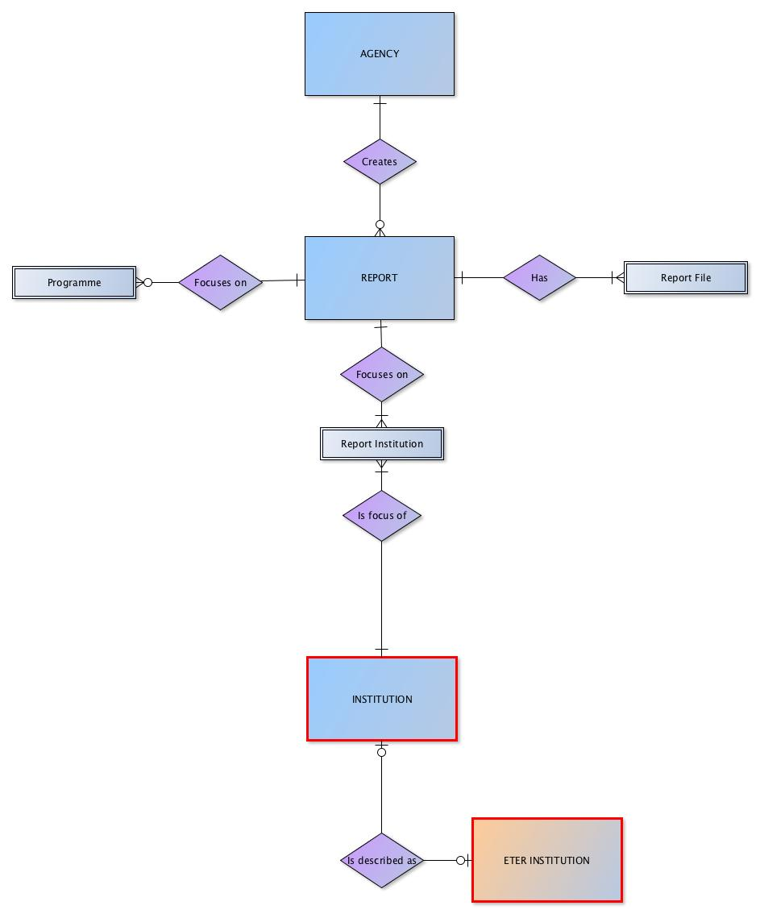
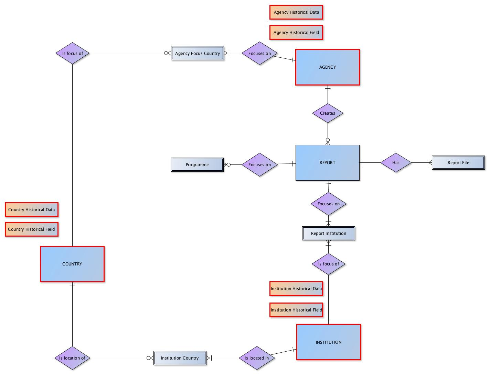

Structural Overview
-------------------
The DEQAR data model has been designed around four main entities: registered quality assurance **Agencies**, higher education **Institutions**, educational **Programmes** associated with institutions, and external quality assurance **Reports**.

Registered agency users are invited to submit and manage information on their external quality assurance reports including information about the particular study programme described in the report, if applicable. On the other hand, institutional information will largely be managed by the EQAR secretariat based on data from ETER/OrgReg. 

EQAR will also continue to collect and manage agency data as well as country data through their registry. These will be linked to report and institution data in DEQAR. To support this, DEQAR also includes a **Country** entity, which contains information on the official external quality assurance regime in any country which hosts an institution evaluated by an EQAR-registered agency.

Further information on the type of information to be collected and stored in DEQAR can be found in the [Operational Model](https://eqar.eu/fileadmin/eqar_internal/MD/MD6/Database_of_External_QA_Results_Report_Model_v3.pdf), section 5.3, page 36.

Functional Overview
-------------------
DEQAR supports three core activities:

- **Submission of data objects:** agencies submit objects and PDF files meeting defined criteria using one of three methods

    - as [individual records via webform](data_submission.md#web-form)
    - as [batch CSV file via webform](data_submission.md#csv-upload)
    - as [JSON using an API](data_submission.md#submission-api)
    
- **Administration of records:** data is ingested and records are created, stored and managed by EQAR staff and agencies over the longer term. Agencies may update and even delete report records already in the system and track their own activity.
- **Search and discovery of information:** records are published on an [public web interface](web_api.md#public-web-interface) for search, retrieval and export or download by end users. There is also a [public API](web_api.md#web-api) available to all registered users; this allows users to embed DEQAR search interface in their local site.

Role of Standards and Identifiers 
--------------------------------

As DEQAR aggregates data from different sources, we face several challenges:

1. To keep the same data from different sources synchronised (e.g. the same institution may be described differently by different agencies),
2. To try to avoid duplication, and
3. To identify already existing records for update if necessary.

To meet these challenges, the DEQAR data model uses standard values at various levels. **Countries** are identified via the [ISO 3166-1 standard](https://en.wikipedia.org/wiki/ISO_3166-1); **Language** data is accepted in [ISO 639-1 or ISO 639-2/B format](https://en.wikipedia.org/wiki/List_of_ISO_639-1_codes).

DEQAR uses a set of standard identifiers which are provided by the system for each entity.  In several cases, we also allow agencies to provide their local or national identifiers for entities in order to ease their internal workflows.  Entities are identified in the following ways:

| Entity      | Recommended Identification | Alternative Identification |
| ----------- | -------------------------- | -------------------------- |
| Agency      | agency acronym             | DEQAR Agency ID            |
| Institution | DEQARINST ID               | ETER ID, local institution identifier|
| Programme   | local programme identifier | DEQAR Programme ID         |
| Reports     | local report identifier    | DEQAR Report ID            |

As a rule, entities already in the system should be identified to facilitate linking up. In other words: 

1. The **agency responsible** for the report *must be identified with any submission*. 
2. An identifier should also be provided for each **institution** *in the case that a record for the institution already exists in DEQAR.* If the institution record does not exist, data must be provided instead.  
3. In the case of **reports** and **programmes**, agencies are encouraged to provide local identifiers with each new submission of data in order to facilitate subsequent linking:

    - For reports, the agency can provide a local identifier with each new report submitted; the local identifier may be provided for later updates using CSV or JSON and may also help each agency to synchronise its local system with DEQAR.
    - For programmes, the first time an agency provides information on a programme to DEQAR, a local (or national) identifier can be submitted along with data on the programme; the identifier can later be used by the agency for any report on the same programme.

The identification of each entity type is explained in detail below.

### Agency Identifiers

Authentication is required before the submission and update of data and files. Thus, the agency responsible for each report can be identified automatically by the system. In some cases, an agency may serve as a *proxy agency* for a *creating agency*, submitting and managing data on its behalf (as in the case of umbrella organisations). In this case, the creating agency’s unique acronym or DEQAR agency ID (which can be found in the administrative interface) must be provided as the source of identification. For this reason, identification of the [Creating Agency](data_submission.md#report-creation) is required for each object when using CSV and JSON. 

### Institution Identifiers 

Institutions already described in DEQAR should be identified in report submissions using one of several identifiers. This allows the system to automatically link report data to existing institution records. 

- DEQARINST IDs: DEQAR automatically generates a so-called "DEQARINST ID" for each institution record that is created in the system. These can be found through the administrative interface. (They are also be returned to the agency as part of the response object after each successful submission.) Ideally, each registered agency will store the DEQARINST IDs for institutions treated in their reports. These are recommended for use in each submission.
    
- ETER IDs: DEQAR harvests records from the ETER/OrgReg database once a year. These records are the source many of the institution records in DEQAR. The ETER ID for these institutions can be found through the administrative interface. The ETER IDs may be stored and used by agencies for submission as an alternative to the DEQARINST IDs.
    
- Local/national identifiers: Agencies may also create and store local or national identifiers for institutions. These can be used for submission as an alternative to the DEQARINST IDs if supplied in advance. Each agency can provide these individually through the administrative interface or these can provided in bulk to the EQAR secretariat.

- Other identification methods: If an agency cannot locate an existing institution record in DEQAR (and therefore cannot provide either the DEQARINST ID, ETER ID or local identifier), then it will need to provide institution data as the source of an entirely new record.  
    Before creating a new record, the system checks to confirm that the record does not already exist. It checks the website URL provided as well as the official and English names against all institution records in the system.  If these do not produce a match, then a new record is created. For this reason, it is recommended that all agencies provide the root domain name (in its shortest form) of the institution website. 
    
*Note: agencies should provide a single identifier; if more than one is provided, the DEQARINST ID will be used to establish the linkage.* 

(See [Institution Data Elements: Linking to an Existing Record](data_submission.md#instituion-data-elements).)

### Report and Programme Identifiers

We strongly recommend that agencies provide a local identifier with each **report** submitted. This will allow for subsequent updates to the record and will ease synchronisation with each agency's local system. Report local identifiers will be stored and can serve to identify records for update/resubmission. DEQAR will also automatically generate a DEQAR ID for each newly submitted report; this will be returned to agencies as part of the response object. The DEQAR ID can be used for updates/resubmission as an alternative to local identifiers.

DEQAR will not synchronise data on **programmes**; however if a local or national identifier is provided at the time of submission, this will be stored in the system. The agency can use the programme identifier if it would like to simply re-use the existing programme data for subsequent reports.

(See [Submission Object Data Elements: Report Identification](data_submission.md#report-identification).)
(See [Submission Object Data Elements: Programme Identification](data_submission.md#programme-identification).)

### Other Identifiers

DEQAR also assigns DEQAR IDs to each agency's **Activities**. These identifiers, which can be found through the administrative interface, may be used instead of the activity name (pre-defined string values) to identify the report activity in each CSV or JSON object. Alternatively, an agency may wish to use its own local activity identifiers; in this case, the agency should supply through their local identifiers through administrative interface before using them for submission. Only one identifier should be provided for each assigned activity (see [Submission Object Data Elements: Report Activity](data_submission.md#report-activity)). (Please note that any changes to the agency's activities, other than purely editorial or technical changes, must be made through [Substantive Change Reports](https://eqar.eu/register/reporting-and-renewal.html#c1585).)

Finally, DEQAR provides DEQAR IDs for standard values used for **Report Status** and **Report Decision** (see [Submission Object Data Elements: Report Details](data_submission.md#report-details)). These can be provided instead of the equivalent string values in CSV or JSON objects.

Building Institution Records
-------------------------------

DEQAR has two basic workflows for creating institution records.  Either records are harvested from the ETER/OrgReg databases (available through [Research infrastructure for research and innovation policy studies - RISIS](http://datasets.risis.eu/) or [European Tertiary Education Register - ETER](https://www.eter-project.com/); or, if no record exists in ETER/OrgReg, a new institution record is created from scratch based on data submitted by an agency.

### Use of Data from ETER/OrgReg

DEQAR harvests records from ETER/OrgReg on an annual basis. These records serve as base set of records on European higher education institutions in DEQAR. DEQAR stores the following ETER data on institutions: 

- ETER ID
- official name
- English name
- acronym
- country
- city (when available)
- latitude/longitude (when available)
- QF-EHEA levels
- institution website

ETER/OrgReg data is managed according to the following principles:

1. As a general policy, DEQAR keeps ETER data stable and unchanged between harvests. 
2. If an agency submits data which is already found in an ETER record, the data *will **not** be used to replace or update ETER data*.
3. If an agency submits data which is not yet found in an ETER record, the data *will be used to supplement the ETER data*.
4. Alternative names and local identifiers (see [**Identifying Entities**](https://docs.deqar.eu/DEQAR_overview/#identifying-entities)) may be added to ETER records and managed by agencies through the administrative interface.  
5. If an agency would like to propose a correction or change of ETER data, the EQAR secretariat should be contacted.
6. The EQAR secretariat reserves the right to adapt ETER records based on the information that we receive through agencies and other sources. 
7. Added information and updates are carried through to records from subsequent harvests.

### Data Not Found in Non-ETER/OrgReg

For data not existing in ETER/OrgReg, a new record must be created. New records are created based on data submitted by an agency. The following data may be submitted: 

- official name
- English name
- acronym
- country
- city
- latitude/longitude
- QF-EHEA levels
- institution website

*Note: the minimum data needed to create a record is: name official, country of institution and website (the URL of domain).* 

Institution data created by agencies is managed according to similar principles as data harvested from ETER/OrgReg:

1. As a general policy, DEQAR keeps institution data, including that submitted directly by an agency, stable and unchanged.
2. If an agency submits data which is already found in the existing record, the data *will **not** be used to replace or update existing data*. 
3. If an agency submits data which is not yet found in an existing institution record, the data *will be used to supplement the existing data*.
4. Alternative names and local identifiers (see [**Identifying Institutions**](https://docs.deqar.eu/DEQAR_overview/#identifying-institutions)) may be added to any institution record and managed by agencies through the administrative interface.
5. If an agency would like to propose a correction or change of existing institution data, the EQAR secretariat should be contacted.
6. The EQAR secretariat reserves the right to adapt records based on the information that we receive through agencies and other sources.   

(See [Submission Object Data Elements: Institution Data Elements](data_submission.md#institution-data-elements).)

### Hierarchical and Historical Institutional Relationships

In those cases that **quality assurance reports are produced for different organisational levels of an institution**, DEQAR collects and stores data on both entities and establishes a hierarchical link between them. This may be the case of an institution and its "child" faculties or of an institution and its "parent" institution group. DEQAR bases its hierarchical links on information taken from ETER/OrgReg. If any agency would like to propose an additional structural link between two or more institutions or institutional levels, then the proposed link can be provided individually or in a longer list to the EQAR secretariat. In the public search interface, quality assurance reports produced for different levels in the same institution will *cascade* -- i.e. records on child institutions will include the reports produced on the parents; records on parent institutions will show the reports produced on its children.

DEQAR will also store information on **historical changes in the structure of institutions, e.g. mergers, splits, spin offs and absorptions**. This will allow users to view historical records in the correct context. It will also facilitate the search and discovery of current institutions.

*Note: historical changes in the structure of agencies will also be stored and presented online.*

Presenting Historical Data
--------------------------

DEQAR not only presents information on the recent ESG-compliant quality assurance activities performed on institutions across Europe and beyond, but also records an historical "trail" of the these activities since 2008, a date which marked the launch of EQAR. Thus DEQAR stores both current and past valid reports on each institution and both are presented to end users through the search interface. 

Initially, agencies should upload information on all external QA procedures that were completed during their registration period and that are still valid. Optionally, agencies may (and are encouraged to) upload information on external QA procedures   that were completed during their registration period, but that have already expired. (As a result, the database is expected to be comprehensive for external QA procedures valid in 2018 and later, whereas the archive will be partial for external QA procedures that expired before 2018.)

DEQAR also captures historical changes in the status and profile of agencies and institutions e.g. name changes, changed activity, physical relocation and changes in the institutional structure (see [**Hierarchical and Historical Institutional Relationships**](https://docs.deqar.eu/DEQAR_overview/#hierarchical-and-historical-institutional-relationships)). Changes in the quality assurance regulations within EQAR countries are also captured. To this end, DEQAR differentiates between updates in data due to typographical or syntax errors, and “substantial” updates considered part of the historical data trail. Historical data will be part of the search domain and can therefore be queried by end users.

Any request for an update to an institution record to record historical changes of this sort may be submitted to the EQAR secretariat for review. (It is part of the daily work of the EQAR secretariat to keep the registry of agencies and countries complete and up to date.  Changes to the agency's activities, other than purely editorial or technical changes, must be made through [Substantive Change Reports](https://eqar.eu/register/reporting-and-renewal.html#c1585). Nevertheless, in case there is a concern about the recorded status, location or activities of a specific agency or of the quality assurance regime in a particular country, questions can also be directed to the EQAR secretariat.) 

