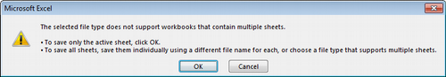

File format
-----------

[Comma-separated values](https://en.wikipedia.org/wiki/Comma-separated_values) is a common platform-independent, software-independent data-exchange format.

The first row of your file should include column names as defined in [...link to add...](http://www.deqar.eu).

The following lines contain one report per row. Where one report may include/relate to several items (e.g. institutions, programmes, files), these can be provided/identified in separate columns using the `field_name[n]` syntax.

For Example, two files (e.g. full report in local language, and summary in both English and local language) can be provided as follows:

```csv
...,file[1].original_location,file[1].display_name,file[1].report_language[1],file[2].original_location,file[2].display_name,file[2].report_language[1],file[2].report_language[1],...
...,"http://some.url/to/report","Expert report","de","http://some.url/to/report","Summary","en","de",...
```

You can use our sample CSV file as a starting point and adjust it to your needs. Please bear in mind the following:

 - The sample file is provided in Microsoft Excel and Open Document Formats. It needs to be saved in CSV format for upload to DEQAR (see notes below).
 - The first line contains the relevant requirement/validation notes for the column as a comment. These comments will disappear as you save the file in CSV format.
 - You need to include all columns you might need in at least one of your reports, but they can stay empty in those lines where they are not applicable.
 - You may omit columns from the sample CSV file that are not used in any of the reports.
 
CSV sample files:

 - [Integrate sample, Excel](http://link.to/somewhere/)
 - [Integrate sample, OpenOffice/LibreOffice/NeoOffice](http://link.to/somewhere/)
 - [Institutional reports, CSV](http://link.to/somewhere/) **not sure if we'll have those**
 - [Programme reports, CSV](http://link.to/somewhere/) **not sure if we'll have those**
 
Prepaing CSV files
------------------

Despite being software-independent, there are some known issues when creating/exporting CSV files from some major office applications. Given that it has the most clean and straight-forward CSV export, we recommend the [LibreOffice package](https://www.libreoffice.org/), an open-source desktop application supported on all major operating systems.

For all software packages, please note that CSV format does not support different sheets, but it will always be only the current work sheet that is saved in CSV format.

**Microsoft Excel**

Despite offering CSV as a target file type in its *Save as* dialogue, Microsoft Excel does not create correct CSV files when certain character sets are used (e.g. Greek or Cyrillic alphabets, or certain Roman characters with diacritics). You can use the following work-around:

 - Select *Save as* from the *File* menu, select your desired folder and choose *Unicode Text (\*.txt)* as type.
 
   
 
 - Simply press *OK* in response to the following error message:
 
   

 - Furthermore, confirm with *Yes* also the following warning message:

   

 - Close Microsoft Excel and navigate to the folder containing your file in the file manager. Right-click on your file and choose *Rename*.
 
 - Now change the file extension from `.txt` into `.csv`. You will encounter the following message: *If you change file name extension, the file may become unusable. You still want to change them, you should press ‘Yes’...* Confirm the warning by clicking Yes.
 
 - This CSV file is now suitable for upload.
 
**LibreOffice/OpenOffice/NeoOffice**

Exporting CSV files is straight-forward in LibreOffice, OpenOffice and NeoOffice:

 - Choose *Text CSV (\*.csv)* as file type in the *Save As ...* or *Save a Copy ...* dialogue:
 
   

 - Ensure the export settings are set as follows in the next dialogue. Please pay particular attention character set and delimiters:
 
   

 - The CSV file is now suitable for upload.
 
**Google Sheets**

Is there anything specific we need to mention?

Uploading CSV file
------------------

The CSV upload module is part of the DEQAR admin interface:

[https://admin.deqar.eu/upload-csv]

The username is the agency’s acronym (in lower case, see reference list). For the testing period, the password is the username followed by `#2018`.

 - Select *Submit Report* > *Upload CSV* from the menu.
 
 - Choose your file under *Select CSV file* and click *Upload*.
 
 - You can now review your data one more time under *Uploaded CSV Data*, and make changes if necessary.

 - Afterwards, click on *Ingest* under the table. The uploaded CSV file now passes the same validation and flagging pipeline as information submitted through any other method.

 - After ingest, you will see all rows highlighted in green if they were succesfully injected, or in red if they could not be ingested due to validation errors. Click on one row to see details about errors or flags in the top-right corner.
 
 - If you experienced errors, you can correct the respective lines and click on *Ingest* again.
 
 - Please note that the green rows will be re-ingested, but overwrite the existing report based on the DEQAR Report ID. Any changes you make to green rows will therefore be recorded on further ingest.
