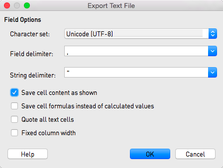

# Report Submission

Each agency should follow three steps to submit their report data:

1. Choose a particular [submission method](#choosing-a-submission-method).
2. Prepare your data with guidance on the [Report Data Elements](report_data.md) above.
3. Submit data using your chosen submission method and review the response after your data has passed through validation and flagging as described in [Data Pipeline](#data-pipeline) below.

## Choosing a Submission Method

Considering the various needs of the agencies, DEQAR supports three different submission methods. Their use is highly dependent on the technical resources available to a particular agency. Important: all three methods are fully interoperable. That is, agencies may switch between different methods at any time, and data submitted via one method may be updated/altered via another method.

[**Webform**](#webform): Those agencies needing a simple means of submitting report data to DEQAR can enter data directly in the webform present in the administrative interface. This method is fully manual; agencies can simply login and create new report records or modify existing ones. Flags and validation errors will be returned immediately upon submission. Data already submitted using CSV or JSON/API will also be accessible through the administrative interface.

We recommend this method for agencies:

* without IT developers
* with a closed system architecture from which data export is not straightforward
* who would like to submit small amounts of data occasionally
* who would like to interact with their DEQAR data directly

[**CSV Upload**](#csv-upload): In order to submit batches of documents, agencies may prefer to work with well-established formats like Excel. [Comma Separated Values (CSV)](https://en.wikipedia.org/wiki/Comma-separated_values) is a flat file format which can be produced and presented directly through Excel, LibreOffce and many other software packages. This termed a semi-automatic data submission method. DEQAR has provided a CSV template which can be complemented with the detailed explanation of the [Report Data Elements](report_data.md) above.

Using CSV, transformation of data can be done manually by administrative staff without the help of IT. Staff can then login to the administrative interface and upload the CSV file for import. When uploading, records (i.e. single lines of the file) are validated and information on the status of each record in the uploaded batch are shown on the import interface. Agency staff can then decide to fix failed records ad-hoc or re-upload them later.

We recommend this method for agencies:

* without IT developers
* with a local system from which they can export data in tables
* who would like to submit bigger amounts of data in a batch
* who would like to work manually on their data before submitting to DEQAR

[**Submission API**](#submission-api): [REST API](https://en.wikipedia.org/wiki/Representational_state_transfer) is a convenient way for software developers to communicate via HTTP, the protocol used by the internet. When used together with the [JSON format](https://www.json.org/) it provides flexible means of exchanging data between systems. With the possibility of sending complex request and response objects, DEQAR can accept structured data and give immediate feedbacks (error checks, warnings) about the submitted data as well as metadata enhancements.

We recommend this method for agencies:

* with IT developers / IT vendors who can develop a method (script/web application) to post data to the API endpoint
* who would like to submit large amounts of data at once with a single call
* who would like to submit individual reports immediately upon their creation
* who would like to keep DEQAR and their local system in sync
* who plan to submit data periodically and at longer intervals (e.g. weekly or monthly).

## Data Pipeline

In general, irrespective of the submission method, all report data submitted to DEQAR is handled following these steps:

1. The first level of validation concerns the data format, including that all required fields are present and all identifiers used are valid. If the record does not pass the requirements and constraints described in [Validation Criteria](#validation-criteria) below, the record is rejected.
2. Valid report data is saved in the database.
3. Sanity checks are run against pre-defined [Flagging Criteria](#flagging-criteria); reports which meet any of these criteria are flagged. Flagged reports are nevertheless saved in the database and should not be re-submitted.
4. A Response Object (or array of objects) is sent back to the agency, containing:
    * detailed error descriptions for report objects that were rejected
    * identifiers of report records that were created or identified
    * information on records where sanity checks found issues.

### Validation criteria

In order for submission objects to clear the first level of validation, they must meet the following criteria:

1. The **agency** that created the report (which may or may not be the agency submitting the records) must be clearly identified and, if your user is not linked to the agency itself, you must have a proxy to submit reports for the agency.

2. Submitted data must **align with the Agency Profile** information, specifically report validity date must be after the Agency's EQAR registration start date and before the registration end date, if applicable.

3. All **required data** must be present for each report. Required data for all records includes:
    * [ESG activity performed](report_data.md#activity)
    * [Status of report](report_data.md#details)
    * [Decision](report_data.md#details)
    * Report [valid from date, including date format](report_data.md#validity) used by the agency
    * At least one [report file](report_data.md#files) including the language(s) in which it is drafted
    * Organisation: a report must relate to at least one [existing organisation record](report_data.md#organisations) identified by a DEQARINST ID, ETER ID or another known identifier.

3. At this point, **dependencies** between elements will be checked as well as any **limits on the number of values permitted** for each element. In particular:
    * Requirements based on the **type of ESG activity**:
        - institutional: no programme data must be provided
        - programme or programme/institution: exactly one organisation must be identified, data on one or several programme(s) must be provided
        - joint programme: at least two organisations must be identified, data on one or several programme(s) must be provided
    * Data required for **each programme** (except institutional reports):
        - the [programme name](report_data.md#programme-name-and-qualification) (in whatever language it is stored by the Agency)
        - the [degree outcome](report_data.md#programme-qualification-level) indicating whether full degree or not – required as from 2024
        - the [qualification level](report_data.md#programme-qualification-level) – required for non-full degree programmes, as from 2024 required for all
    * Data required for **programmes with degree outcome "no"** (= not leading to a full degree):
        - [Workload expressed in ECTS](report_data.md#programme-details)
        - Whether programme includes [assessment or certification](report_data.md#programme-details)
    * Constraint if any programme covered by the report has **degree outcome "no"** (= not leading to a full degree):
        - Report must be marked as [micro-credentials included/covered](report_data.md#details)
    * Constraints for **reports on only alternative providers**, i.e. when none of the organisations identified is a higher education institution:
        - [Status](report_data.md##report-details) may only be "voluntary"
        - [Degree outcome](report_data.md#programme-qualification-level) must be "no" (= no full degree)

4. Submitted data must be of the **correct type, form and value range/options** as described above.

Records not meeting all of the above criteria will be rejected and no data on the report will be saved. The system will return a response object that clearly identifies rejected records, including information on the source of the problem. Importantly, the rejection of one or more submission objects does not imply the failure of the whole submission batch.

### Flagging criteria

Once the report data passed the first level of validation, DEQAR report records are created or updated with the submitted data. Now, some final sanity checks are run on the records: records may receive a “low-level flag” or a “high-level flag”.

In the first case, records will appear online with submitted data, while the EQAR Secretariat is informed to take note. In the second case, records will not be published until they have been checked and confirmed by the EQAR Secretariat.

> The purpose of a flag is to bring a report to the EQAR Secretariat's attention. A flag normally does **not** indicate that data should be changed. Therefore, provided that the data you entered/uploaded is correct, please do **not** try to change the data of a report in order to prevent it from being flagged, but simply wait for EQAR staff to have checked the report.

Sanity checks may result in **high-level flags** for the following reasons:

* Report Status is listed as *part of obligatory EQA system* and the Agency does not have official status (according to EQAR's information) in any legal seat country of any higher education covered by the report.

    > For reports on both alternative providers and higher education institutions, agency must have official status in one of the higher education institutions' countries, the status in the alternative providers' countries is not relevant to this check.

Sanity checks may result in **low-level flags** for the following reasons:

* Report is on an organisation with a legal seat in or a programme delivered in a country in which the agency has not previously been active.
* Country of the programme (if specified) does not match any location country of any organisation covered.
* Programme-level report is "voluntary" and the programme's qualification level is not contained in the list of qualification levels of any of the higher education institutions specified
* One or more PDF files of the report could not be downloaded (in case a URL was specified) or was not yet uploaded (using the specific API endpoint)

In addition, the following data on agencies or institutions will automatically be complemented at flagging stage:

* If the report is on an organisation with a legal seat in or a programme delivered in a country in which the agency has not previously been active, this country will automatically be added to the agency's profile.
* Programme qualification level is added to a higher education institution's qualification levels if the report is "part of the obligatory EQA system".
* Programme qualification level is always to an alternative provider's qualification levels.

## Webform

The DEQAR administrative interface includes an interactive webform, allowing you to submit single reports. The administrative interface is available at:

location: <https://admin.deqar.eu/>  
username: [agency's acronym (in lower case)]  
password: [your personal password]

If you do not remember your password or did not change the default password, please go to <https://admin.deqar.eu/forgot-password> in order to reset your password. You need to enter your email address and will receive by email a special link that allows you to set a new password.

The email address linked to your login is the same email address to which submission report emails are sent. If you do not remember which email address is linked to your agency's login, please contact the EQAR Secretariat.

The webform can be found in the menu under *Submit Report* > *[Report Form](https://admin.deqar.eu/submit-report)*.

Required fields are marked with a <span style="color: #f00;">\*</span> in the form; fields marked with a <span style="color: #f00;">(\*)</span> are conditionally required. Please note that the [Activity](#report-activity) chosen might influence which information is required (see [Report Data Elements](report_data.md) above). The *Save Record* button becomes active once all required information has been provided.

We strongly recommend that you provide a [Local Report Identifier](#report-identification) that identifies the specific report in your own information system or workflow, even when you use the webform. This will facilitate later updates should they be necessary, and can be useful if your agency changes to CSV upload or the Submission API later on.

You can select institutions using the search box. If you are uploading a report on an institution that has no DEQAR record yet, see [Institution Data](institution_data.md) on how to add it before uploading reports.

Data on programmes will only be needed if your report results from a programme-level activity. Fill the form with the required information and then click the *Add Programme* button. If the report concerns several programmes (e.g. clustered evaluation) please repeat the step for all programmes concerned. (See [Programme Data Elements](#programme-data-elements) above.)

Each report may contain one or more report files (for example, the experts' report, a possible summary report and the decision taken might be contained all in one or in separate files). The report file fields are conditionally required. At least one must be present, but agencies can either provide a URL or upload a file directly (in either case, only PDF files are accepted). For each file, please specify the language(s) of its contents. The display name is optional; the text "Report" will be used as a default otherwise. (See [QA Report Files](#qa-report-files) above.)

## CSV Upload

[Comma-separated values (CSV)](https://en.wikipedia.org/wiki/Comma-separated_values) is a common and interoperable data-exchange format. Files can be imported and exported from all usual [spreadsheet software](#preparingexporting-csv-files) (e.g. Excel, LibreOffice, ...) and numerous other applications.

The first row of your file is a header which should include column names as defined under [Report Data Elements](report_data.md) above. The following lines contain one report per row. A simple example of a CSV first-fow header for institution-level reports could look as follows:

```
agency, activity, status, decision, valid_from, valid_to, date_format, file[1].original_location, file[1].report_language[1], institution[1].eter_id
```

(Spaces added for readability, these should not appear in an actual file.)

One report may often include/relate to several items, such as one or more institution(s), programmes or one or more files--some in several languages. In those cases you will find field names of the type `field_name[n]` (See [Report Data Elements](report_data.md) above). You should create as many columns as you need and replace `n` by 1, 2, ...

For example, two files (e.g. full report in local language, and summary in both English and local language) can be provided as follows:

```
..., file[1].original_location,   file[1].display_name, file[1].report_language[1], file[2].original_location,   file[2].display_name, file[2].report_language[1], file[2].report_language[2], ...
..., "http://some.url/to/report", "Expert report",      "de",                       "http://some.url/to/report", "Summary",            "en",                       "de", ...
```

(Spaces added for readability, these should not appear in an actual file.)

You can use one of the sample CSV files below as a starting point and adjust it to your needs. Please bear in mind the following:

* The template file is provided in Microsoft Excel and Open Document Formats, as well as viewable on-line. **It needs to be saved in CSV format for upload to DEQAR** (see notes below).
* The first worksheet includes *all* possible column names you could use in a CSV file, with the respective requirement/validation notes as comments. These comments will disappear as you save the file in CSV format.
* The subsequent worksheets include more condensed examples with sample data, including those columns that will typically be used in reports concerning institutions, programmes or joint programmes.
* You need to include all columns you might need in at least one of your reports, but they can stay empty in those lines where they are not applicable.
* You may omit columns from the sample CSV file that are not used in any of the reports.

### Template and samples

* [Microsoft Excel format](files/SubmissionTemplate.xlsx)
* [Open Document Format (OpenOffice/LibreOffice/NeoOffice)](files/SubmissionTemplate.ods)
* [Sample in CSV format](files/SubmissionSample_mixed.csv) (without comments)

### Preparing/exporting CSV files

Despite being software-independent, there are some known issues when creating/exporting CSV files from some major office applications. Given that it has the most clean and straight-forward CSV export, we recommend the [LibreOffice package](https://www.libreoffice.org/), a free and open-source desktop application supported on all major operating systems.

For all software packages, please note that CSV format does not support multiple sheets, but it will always be only the current work sheet that is saved in CSV format.

#### Microsoft Excel

Despite offering CSV as a target file type in its *Save as* dialogue, Microsoft Excel does not create correct CSV files when certain character sets are used (e.g. Greek or Cyrillic alphabets, or certain Roman characters with diacritics). You can use the following work-around:

* Select *Save as* from the *File* menu, select your desired folder and choose *Unicode Text (\*.txt)* as type.<br /> 
* Simply press *OK* in response to the following error message:<br /> 
* Furthermore, confirm with *Yes* also the following warning message:<br /> 
* Close Microsoft Excel and navigate to the folder containing your file in the file manager. Right-click on your file and choose *Rename*.
* Now change the file extension from `.txt` into `.csv`. You will encounter the following message: *If you change file name extension, the file may become unusable. You still want to change them, you should press ‘Yes’...* Confirm the warning by clicking Yes.
* This CSV file is now suitable for upload.

#### LibreOffice/OpenOffice/NeoOffice

Exporting CSV files is straight-forward in LibreOffice, OpenOffice and NeoOffice:

* Choose *Text CSV (\*.csv)* as file type in the *Save As ...* or *Save a Copy ...* dialogue:<br /> 
* Ensure the export settings are set as follows in the next dialogue. Please pay particular attention character set and delimiters:<br /> 
* The CSV file is now suitable for upload.

#### Google Sheets

In Google Sheets, choose *Comma-separated values* from the *File* > *Download as...* menu.

### Uploading CSV files

The CSV upload module is part of the DEQAR admin interface:

location: <https://admin.deqar.eu/upload-csv>  
username: [agency's acronym (in lower case)]  
password: [your personal password] (see [above](#webform) how to reset your password)

* Select *Submit Report* > *Upload CSV* from the menu.
* Choose your file under *Select CSV file* and click *Upload*.
* You can now review your data one more time under *Uploaded CSV Data*, and make changes if necessary.
* Afterwards, click on *Ingest* under the table. The uploaded CSV file now passes the same [validation](#validation-criteria) pipeline as information submitted through any other method.
* After ingest, you will see all rows highlighted in green if they were succesfully injected, or in red if they could not be ingested due to validation errors. Click on one row to see details about errors or [flags](#flagging-criteria) in the top-right corner.
* If you experienced errors, you can correct the respective lines and click on *Ingest* again.
* Please note that the green rows will be re-ingested, but overwrite the existing report based on the DEQAR Report ID. Any changes you make to green rows will therefore be recorded on further ingest.

## Submission API

REST API is a convenient way for software developers to communicate with web services via HTTP, the protocol used by the internet. Together with JSON it provides an easy, straightforward and flexible means of exchanging data between systems. With the possibility of sending complex request and response objects, we can accept structured data and give immediate feedbacks (e.g. error checks, warnings) about the submitted data as well as metadata enhancements (e.g. ETER IDs on HEIs, when applicable; links to new records on the EQAR public interface, etc.).

### Authentication

Requests for submission to DEQAR are only accepted from registered users and must therefore be identified. DEQAR API endpoints manage authentication using API Tokens (through the so-called Bearer Authentication method). Upon registration, an API Token (which is basically a hash) is created for each user. Sending this token in the Authorization header (with type/scheme Bearer) will authenticate the user in place of a regular username and password.

To get your authentication token you can send a `POST` request to the following URL:

`https://backend.deqar.eu/accounts/get_token/`

An example of obtaining a token using curl in command line:

```sh
curl -s -H "Content-Type: application/json" -XPOST https://backend.deqar.eu/accounts/get_token/ --data '{"username":"testuser","password":"testpassword"}'
```

The username is the agency’s acronym (in lower case). Please see [above](#webform) how to reset your password.

Or for those who prefer to use the more user friendly [HTTPie](https://httpie.io/) client:

```sh
http POST https://backend.deqar.eu/accounts/get_token/ 'username=testuser' 'password=testpassword'
```

You should send this token, preceded by the word `Bearer`, in the Authorization header with every further request. An example of a submission using curl or HTTPie:

```sh
curl -s -H "Content-type: application/json" -H "Authorization: Bearer $DEQAR_TOKEN" -XPOST https://backend.deqar.eu/submissionapi/v1/submit/report --data-binary @$DEQAR_FILE

http -v POST https://backend.deqar.eu/submissionapi/v1/submit/report "Authorization: Bearer $DEQAR_TOKEN" "Content-type: application/json" < $DEQAR_FILE
```

### Report Submission Endpoint

The address of the submission endpoint is:

`https://backend.deqar.eu/submissionapi/v1/submit/report`

This is the URL that you can use to make a `POST` request including the Submission Request Object as JSON object, or many objects as JSON array of objects in the request body.

The **Submission Request Object** is the JSON object (or array of objects) which is the manifestation of a report or set of reports an agency wants to submit.

Fields and accepted types are as described in [Report Data Elements](report_data.md) above. The full definition of request and response objects can be find in OpenAPI format under:

<https://backend.deqar.eu/submissionapi/v1/swagger/>

**Important:** Please do **not** include institution data (such as name, location, etc.) in your Submission Request Object. The corresponding fields are deprecated and will be removed in version 2 of the Submission API. Identify institutions by one single [identifier](architecture_data_model.md#institution-identifiers) only (DEQARINST ID, ETER ID, local or other identifier). New institutions [must be added separately beforehand](institution_data.md#institution-data-elements).

### Report File Submission Endpoint

Files (PDF versions of reports) can be submitted in two separate ways:

* URLs submitted with a Submission Request Object will be harvested asynchronously upon successful submission.
* Files can be submitted directly to a dedicated endpoint as part of a `PUT` request: `https://backend.deqar.eu/submissionapi/v1/submit/reportfile/<report_file_id>/<filename>`

  `report_file_id`: The id number of the Report File object available in the response after successful submission. The `report_file_id` is contained in the response object of the successful report submission. `filename`: The name of the file that you will submit in this request.

### Examples

The examples below show how a JSON Submission Request Object might look for different types of reports:

#### Institutional report

```json
[
    {
        "agency": "MusiQuE",
        "local_identifier": "CRDB-October14",
        "activity": "183",
        "status": "part of obligatory EQA system",
        "decision": "positive",
        "valid_from": "2016-10-28",
        "valid_to": "2018-01-15",
        "date_format": "%Y-%m-%d",
        "report_files": [
            {
                "original_location": "http://www.musique-qe.eu/userfiles/File/2014-10-bruxelles-website.pdf",
                "display_name": "Evaluation report",
                "report_language": [
                    "fr"
                ]
            }
        ],
        "institutions": [
            {
                "eter_id": "BE0035"
            }
        ]
    },
    {
        "agency": "MusiQuE",
        "local_identifier": "ENH-4711",
        "activity": "97",
        "status": "2",
        "decision": "4",
        "valid_from": "2021-01-15",
        "date_format": "%Y-%m-%d",
        "report_files": [
            {
                "original_location": "http://www.musique-qe.eu/userfiles/File/2015-06-25-hamu-review-reportfinal.pdf",
                "display_name": "Institutional Review",
                "report_language": [
                    "eng"
                ]
            },
            {
                "original_location": "https://zenodo.org/record/4516653/files/Database_of_External_QA_Results_Report%2BModel_2016.pdf?download=1",
                "display_name": "Addendum to the report",
                "report_language": [
                    "ger"
                ]
            }
        ],
        "institutions": [
            {
                "deqar_id": "DEQARINST0390"
            },
            {
                "eter_id": "AT0006"
            }
        ]
    }
]
```

#### Programme report

```json
{
    "agency": "MusiQuE",
    "local_identifier": "SHM-April09",
    "activity": "181",
    "status": "2",
    "decision": "1",
    "valid_from": "2017-04-09",
    "valid_to": "2022-02-15",
    "date_format": "%Y-%m-%d",
    "report_files": [
        {
            "original_location": "http://www.musique-qe.eu/userfiles/File/2009-06-report-trossingen-website.pdf",
            "display_name": "Review report",
            "report_language": [
                "ger"
            ]
        }
    ],
    "institutions": [
        {
            "eter_id": "DE0140"
        }
    ],
    "programmes": [
        {
            "identifiers": [
                {
                    "identifier": "16"
                }
            ],
            "name_primary": "Organ Expert",
            "qualification_primary": "Master of Arts",
            "nqf_level": "level 7",
            "qf_ehea_level": "second cycle"
        }
    ]
}
```

#### Joint Programme report

```json
{
    "agency": "MusiQuE",
    "local_identifier": "EAMT-September13",
    "activity": "182",
    "status": "voluntary",
    "decision": "positive",
    "valid_from": "15.01.2020",
    "valid_to": "15.01.2025",
    "date_format": "%d.%m.%Y",
    "report_files": [
        {
            "original_location": "http://www.musique-qe.eu/userfiles/File/final-reportaec-programme-reviewcopeco.pdf",
            "display_name": "Review report",
            "report_language": [
                "eng"
            ]
        }
    ],
    "institutions": [
        {
            "eter_id": "EE0022"
        }, {
            "eter_id": "SE0037"
        }, {
            "identifiers": [
                {
                    "identifier": "F  LYON24",
                    "resource": "Erasmus"
                }
            ]
        }, {
            "deqar_id": "DEQARINST0460"
        }
    ],
    "programmes": [
        {
            "identifiers": [
                {
                    "identifier": "18"
                }
            ],
            "name_primary": "CoPeCo – Contemporary Performance and Composition",
            "qualification_primary": "Master (no joint degree)",
            "nqf_level": "level 6",
            "qf_ehea_level": "second cycle"
        }
    ]
}
```

#### Micro-credential provided by a higher education institution

(add when API and field names are 100% final)

#### Audit of an alternative provider

(add when API and field names are 100% final)

#### Accreditation of a micro-credential provided by an alternative provider

(add when API and field names are 100% final)

## Updating Reports

Normally, once a QA report has been published it will not change. Changing or updating reports in DEQAR should therefore be the exception, rather than regular practice.

Reports can, however, be changed if needed as follows:

 1. **Manually via admin interface**

    Please find the report that you want to change in the admin interface, under under Reference data > Reports. To narrow down the search, use filters and search by report number, name, year, agency, country, activity type and flag. Once you find the report, open the record and click on Edit Report. When submitting, please leave a short note to explain the changes you made.

 2. **Submission API or CSV Upload**

    Please use the same method/template as for initially uploading reports.

    Use either the DEQAR Report ID (`report_id`) or the same [Local Report Identifier](report_data.md#report-identifier) (`local_identifier`) that you provided to DEQAR with your earlier/initial upload of the report. Lacking an ID prevents the system from recognising the report that needs to be updated, and will lead to creation of new (duplicate) record in the database, not overwriting.

    As the system replaces the entire record, you must provide the full submission object once again, including all fields and not just the altered ones.

    Failing to provide information in required fields will lead to rejection of the change, and the old record will remain. Failing to provide information in optional fields will empty those fields, even if they were filled before, and will thus cause deletion of the information.

## Sandbox

The DEQAR Sandbox, like any sandbox, is intended for you to “play”, enabling you to trial particular submission methods, data structures, formats and syntax. More specifically, it is a space where we encourage (even urge) you to test your submissions before putting them into the live system.

The Sandbox is reached through separate links:

* To test the manual and CSV submission, go to the Sandbox Administrative Interface at: <https://admin.sandbox.deqar.eu/>
* To test API submission, go to the Sandbox Submission API at: <https://backend.sandbox.deqar.eu/submissionapi/v1/submit/report>
* To see what your records will eventually look like on the public site, go to the Sandbox Public Interface at: <https://sandbox.deqar.eu/>

The Sandbox is an identical copy of the live system. The entire data of the live site is copied over to the Sandbox every night. Thus, your login and password are the same as in your DEQAR account—unless you have made changes within the last 24 hours. You can also reset or change your password in the Sandbox, but it will be overwritten by the next day.

