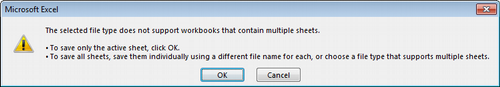
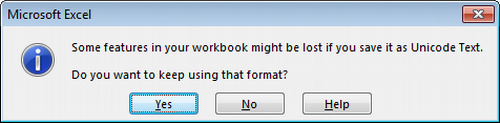
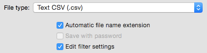

Agencies are asked to prepare data on quality assurance reports for submission to DEQAR.  Each agency has the choice to manually submit records one by one through the DEQAR administrative interface or to submit larger batches of data in CSV or JSON format. In the latter cases, the agency must prepare Submission Objects before uploading to DEQAR. A submission object is data related to a single report and is used during ingest to populate report records and to establish linkages inside the system. (Note: a submission object cannot be considered as a report record per se because it may include data stored in other entities as well.) 

Submission objects can be packaged together for batch submission. Though they are used mostly to introduce new report records into DEQAR, submission objects can also be used to update information on existing records through batch submission. Deletion of existing records can only be performed through the administrative interface. 

Each agency should follow four discrete steps to prepare their data submission:

1. Choose a particular submission method:
    - [Manual Entry through Webform](data_submission.md#webform)
    - [Batch Submission in CSV through Webform](data_submission.md#csv-upload)
    - [Batch or Event Driven Submission in JSON through the API](data_submission.md#submission-api)
2. Prepare your data with guidance from the [Submission Object Data Elements](data_submission.md#submission_object_data_elements) section below.
3. Submit data using your chosen submission method.
4. Await data ingest via the [Data Pipeline](data_submission.md#data-pipeline) and receive response object with possible further instructions.

## Choosing a Submission Method

Considering the various needs of the agencies, DEQAR supports three different submission methods. Their use is highly dependent on the technical resources available to a particular agency. Importantly, all three methods are fully interoperable. That is, agencies may switch between different methods at any time, and data submitted via one method may be updated/altered via another method.

### Data Submission via Webform  

Those agencies needing a simple means of submitting report data to DEQAR can enter data directly in the webform present in the administrative interface. This method is fully manual; agencies can simply login and create new report records or
modify existing ones. Flags and validation errors will be returned immediately upon submission. Data already submitted using CSV or JSON/API will also be accessible through the administrative interface.

We recommend this method for agencies:

- without IT developers
- with a closed system architecture from which data export is not straightforward
- who would like to submit small amounts of data occasionally
- who would like to interact with their DEQAR data directly

(See [Webform](data_submission.md#webform) below.)  

### Data Submission in CSV via Webform  

In order to submit batches of documents, agencies may prefer to work with well-established formats like Excel. [Comma Separated Values (CSV)](https://en.wikipedia.org/wiki/Comma-separated_values) is a flat file format which can be produced and presented directly through Excel, LibreOffce and many other software packages. Since CSV is a flat format (a single records or object per row), there is some redundancy in the data collected. Thus, this is termed a semi-automatic data submission method. DEQAR has provided a submission file template which can be complemented with the detailed explanation of the data elements below (see [Submission Object Data Elements](data_submission.md#submission-object-data-elements)).

Using CSV, transformation of data can be done manually by administrative staff without the help of IT. Staff can then login to the administrative interface and upload the CSV file, staging it for import. When the upload is complete, records (i.e. single lines of the file) are validated and statistics on the status of the uploaded batch are shown on the import interface. Agency staff can then decide to submit the valid records or revert the entire batch, correcting the data in the CSV file and re-uploading it for import. 

We recommend this method for agencies:

- without IT developers
- with a local system from which they can export data in tables
- who would like to submit bigger amounts of data in a batch
- who would like to work manually on their data before submitting to DEQAR

(See [CSV Upload](data_submission.md#csv-upload) below.) 

### Data Submission in JSON via API  

[Rest API](https://en.wikipedia.org/wiki/Representational_state_transfer) is a convenient way for software developers to communicate via HTTP, the protocol used by the internet. When used together with the [JSON format](https://www.json.org/) it provides fexible means of exchanging data between systems. With the possibility of sending complex request and response objects, DEQAR can accept structured data and give immediate feedbacks (error checks, warnings) about the submitted data as well as metadata enhancements.

We recommend this method for agencies:

- with IT developers / IT vendors who can develop a method (script/web application) to post data to the API endpoint
- who would like to submit large amounts of data at once with a single call
- who would like to individual reports upon their creation
- who would like to keep DEQAR and their local system in sync
- who plan to submit data periodically and at longer intervals (e.g. weekly or monthly).

(See [Submission API](data_submission.md#submission-api) below.)

## Submission Object Data Elements 

Below we provide a full list of the data elements that can make up a submission object. It is important to note that the below list is exhaustive, including all possible elements. Required data elements are listed in **bold** with a \* , conditionally required data elements in **bold** with a (\*).  We use the terminology:

 - "must" to denote that an element is required or required in certain situations
 - "should" to denote that an element is highly recommended
 - "may" to denote that an element is optional
 
 (See [RFC 2119 Best Current Practice](https://tools.ietf.org/html/rfc2119).)

   |ELEMENT NAME                                 |REQUIRED     |ONE/MANY  |EXAMPLE                 |      
   |:--------------------------------------------|:------------|:---------|:-----------------------|
   |**Agency\***                                 |yes          |one       |*AAQ*<br>*33*           |  
   |DEQAR Report ID                              |no           |one       |*000786*                |
   |Local Identifier                             |no           |one       |*QAA1153-March15*       |
   |**Activity(\*)**                             |conditionally|one       |*institutional audit*<br>*programme evaluation*<br>*2*<br>*8*|   
   |**Activity Local Identifier(\*)**            |conditionally|one       |*inst_aud*              |
   |**Status\***                                 |yes          |one       |*1 - part of obligatory EQA system*<br>*2 - voluntary*|
   |**Decision\***                               |yes	       |one       |*1 - positive*<br>*2 - positive with conditions or restrictions*<br>*3 - negative*<br>*4 - not applicable*|
   |**Valid from\***                             |yes          |one       |*2015-01-15*            |
   |Valid to                                     |no           |one       |*2020-01-15*            |
   |**Date Format\***                            |yes          |one       |*%d/%m/%y*              |
   |Link                                         |no           |many      |*http://srv.aneca.es/ListadoTitulos/node/1182321350*|
   |Link Display Name                            |no           |many      |*General information on this programme.*|
 
### Report Creation

A single creating agency must be clearly identified for each report. The creating agency is often, though not always, the same as the submitting agency (see [Agency Identifiers](architecture_data_model.md#agency-identifiers)).  

- **Agency\*** (<code>agency</code>; required; string)  
The agency which created the report must be provided for each report as an agency acronym or as a DEQAR agency ID. This allows the report to be linked to an existing agency record and makes it possible to validate and transform the submitted data in accordance with the agency's profile.  
*e.g. AAQ*  
*e.g. 33*  

### Report Identification 

A report identifier must be used when submitting updates to an existing report in CSV or JSON. Each report can be identified using an agency's local identifiers or through DEQAR report IDs, which are assigned at upload. It is recommended that agencies submit local report identifiers with every submission object (see [Report and Programme Identifiers](architecture_data_model.md#report-and-programme-identifiers)).  

- DEQAR Report ID (<code>report_id</code>; not required; string)  
Each uploaded report is assigned a unique DEQAR report ID. This may be used to submit updates to existing reports or to promote synchronisation with an agency's local system.  
*e.g. 000786* 

- Local Identifier (<code>local_identifier</code>; not required; string)  
The report identifier used in the agency's local system should be provided for each report. This may be used to submit updates to existing reports or to promote synchronisation with the agency's local system; the local report identifier is particularly useful in the identification of invalid submission objects.  
*e.g. QAA1153-March15*

### Report Activity

A single activity must be assigned to each report. Activities are selected from the agency's pre-defined list of activities and should be provided as a DEQAR value (as either a string value or a DEQAR activity ID). Optionally an agency may choose to provide local identifiers for its own activities; before these can be used for submission, these identifiers should be assigned through the agency record in the administrative interface (see [Role of Standards and Identifiers: Other Identifiers](architecture_data_model.md#other-identifiers). If both elements are submitted for a single report, then the DEQAR value will be used by the system.  

- **Activity(\*)** (<code>activity</code>; conditionally required; string)  
A DEQAR activity value may be provided as an activity name or DEQAR activity ID for each report. The activity is used to validate the structure of submitted report data.  
*e.g. institutional audit*  
*e.g. programme evaluation*  
*e.g. 2*  
*e.g. 8*  

- **Activity Local Identifier(\*)** (<code>activity_local_identifier</code>; conditionally required; string)  
A local activity identifier may optionally be provided in place of a DEQAR activity value for each report. The local activity identifier may be used to validate the structure of submitted report data. (Note: local activity identifiers need to be assigned through the administrative interface before they can be used in submission.)  
*e.g. inst_aud*  

Each activity is classified as one of four activity types (<code>activity_type</code>). These classifications determine the structure of the report record.  

|Type                   |Report record structure        |               
|:----------------------|:------------------------------| 
|institutional          |at least one institution<br>no programme|
|institutional/programme|one and only one institution<br>at least one programme|
|programme              |one and only one institution<br>at least one programme|
|joint programme        |at least two institutions<br>at least one programme|  

    	
### Report Details

Each report must be assigned a single status and a single decision value. Together these elements signal the role, status and nature of the report.  Status and decision values may be provided as either string values or DEQAR IDs.  

- **Status\*** (<code>status</code>; required; string)  
The status must be provided as either a DEQAR status name or a DEQAR status id for each report. The status specifies whether the report is part of the obligatory EQA system in the country of the institution or whether the institution has undertaken it voluntarily.  

   |ID |name                          |
   |:--|:-----------------------------|
   |1  |part of obligatory EQA system | 
   |2  |voluntary                     |  
   		
- **Decision\*** (<code>decision</code>; required; string)  
The decision must be provided as either a DEQAR decision name or a DEQAR decision id for each report. The decision records the final result of the QA procedure/report.  

   |ID |name                                    |
   |:--|:---------------------------------------|
   |1  |positive                                | 
   |2  |positive with conditions or restrictions|
   |3  |negative                                |
   |4  |not applicable                          |  

### Report Validity

Each report must have an associated date defining the start of its validity. A date defining the end of the report's validity should also be provided. In the cases that the end date is left open, the report will be treated as valid for six years from the start of its validity, after which it will be archived. DEQAR uses a special notation to denote the date format. This allows each agency to signal the date format it uses; this must be provided for each report.
		
- **Valid from\*** (<code>valid_from</code>; required; date)  
A valid from date marking the starting date of the report's validity must be provided for each report. This date is used to generate an archiving date when no valid to date is provided.  
*e.g. 2015-01-15*
		
- Valid to (<code>valid_to</code>; not required; date)  
A valid to date marking the ending date of the report's validity should be provided for each report. This date determines when report data will be archived in DEQAR. If no valid to date is assigned, then the report will be treated as valid for six years after the valid from date.  
*e.g. 2020-01-15*
		
- **Date Format\*** (<code>date_format</code>; required; string)  
A date format  must be provided for each report. Dates may be submitted in any standard format; the format should be represented as a combination of the following characters:  

   |symbol(s)| meaning                               |example                      |      
   |:--------|:--------------------------------------|:----------------------------|
   |%d       |day as expressed in two digits         |02                           | 
   |%-d      |day as expressed in one or two digits  |2                            |
   |%m       |month as expressed in two digits       |05 for May                   |
   |%-m      |month as expressed in one or two digits|5 for May and 12 for December|
   |%Y       |year as expressed in four digits       |2014                         |
   |%y       |year as expressed in two digits        |14                           |
   |d-%m-%Y  |                                       |04-01-2014                   |
   |%d/%m/%y |                                       |04/01/14                     |
   |%Y-%m-%d |                                       |2015-01-15                   |  

### Report Link

One or more URL links may be provided to alternative views of the report data on the agency's website or other webpage(s) in order to provide more context. A display name may be provided for each URL link. The linked text will display on DEQAR under the display name label provided or, if no name is provided, under generic text provided by DEQAR. 

- Link (<code>link[n]</code>, not required, string)  
One or more URL links may be provided for each report to the same report presented on other sites in order to provide more context to the report.  
*e.g. http://srv.aneca.es/ListadoTitulos/node/1182321350*
		
- Link Display Name (<code>link_display_name[n]</code>, not required, string)  
A display name may optionally be provided for each link to the report on other sites. If no display name is provided, then EQAR will supply generic text.  
*e.g. General information on this programme.*

### Institution Data Elements

#### Linking to an Existing Record  

Each report must be associated with at least one institution. If a record for the institution already exists in DEQAR, a DEQARINST ID or an ETER ID should be provided to establish a link to the existing record. Optionally an agency may choose to provide a local or national identifier for an institution; before these can be used for submission, local identifiers should be assigned to existing institution records through the administrative interface or provided in bulk to the EQAR secretariat.  Only one institution identifier should be submitted for each institution in the submission object (see [Institution Identifiers](architecture_data_model#institution-identifiers)). If more than one identifying element is submitted, then the DEQARINST ID will be used to establish internal linkage, followed by the ETER ID. If no record for the institution exists in DEQAR, a new record can be created by filling in several descriptive elements (see [New Institution Record](#new-institution-record) below). 

   |ELEMENT NAME                                 |REQUIRED     |ONE/MANY  |EXAMPLE                 |       
   |:--------------------------------------------|:------------|:---------|:-----------------------|
   |**DEQARINST ID(\*)**                         |conditionally|one (per) |*DEQARINST0034*         |
   |**ETER ID(\*)**                              |conditionally|one (per) |*BG0001*                |
   |**Local Institutional Identifier(\*)**       |conditionally|many (per)|*HCERES21*<br>*AT0004*  |
 
- **DEQARINST ID(\*)** (<code>institution[n].deqar_id</code>; conditionally required; string)  
Each institution already described in DEQAR is assigned a DEQARINST ID.  The DEQARINST ID may be used to establish a link between submitted report data and an existing institution record.  
*e.g. DEQARINST0034*  

- **ETER ID(\*)** (<code>institution[n].eter_id</code>; conditionally required; string)  
Each institution described in OrgReg or ETER is assigned an ETER ID (see [Research infrastructure for research and innovation policy studies - RISIS](http://datasets.risis.eu/) or [European Tertiary Education Register - ETER](https://www.eter-project.com/)). The ETER ID may be used to establish a link between submitted report data and  an ETER record in DEQAR.  
*e.g. BG0001*  
		
- **Local Institutional Identifier(\*)** (<code>institution[n].identifier[1]</code>; conditionally required; string)  
A local identifier is any identifier used by the Agency to identify an institution. A local identifier may optionally be used in the place of a DEQARINST ID or ETER ID to establish a link between submitted report data and an existing institution record. (Note: local institution identifiers need to be assigned through the administrative interface or in bulk through the EQAR secretariat before they can be used in submission.)  
*e.g. HCERES21*  
*e.g. AT0004*  

#### New Institution Record 
 
Each report must be associated with at least one institution. If a record for an institution does not already exist in DEQAR, the institution must be described with the elements below. (Note, **as a minimum the institution name, country and website must be provided** for a new record to be created.) Before a new record is created, data will be checked against institution data already in DEQAR. If a DEQAR institution record is identified as a match, the existing record will take precedence over submitted data.  

   |ELEMENT NAME                                 |REQUIRED     |ONE/MANY  |EXAMPLE                 |        
   |:--------------------------------------------|:------------|:---------|:-----------------------|
   |**Official Institution Name(\*)**            |conditionally|one (per) |*Graz University of Technology*<br>*Югозападен университет "Неофит Рилски"*<br>*Πληροφορίες για τους αλλοδαπούς φοιτητές: Είσοδος και προγράμματα*|
   |Official Institution Name, transliterated    |no           |one (per) |*Yugo-zapaden universitet "Neofit Rilski”*<br>*Plirophoríes yia tous allodapoús phitités:  Ísodos kai prográmmata*|
   |English Institution Name                     |no           |one (per) |*South-West University "Neofit Rilski", Blagoevgrad*|
   |Institution Acronym                          |no           |one (per) |*SWU*                   |
   |**Institution Country(\*)**                  |conditionally|many (per)|*BG*<br>*BGR*           |
   |Institution City                             |no           |many (per)|*Sofia*                 |
   |Institution Latitude<br>Institution Longitude|no           |many (per)|*48,208,356; 1,636,776* |
   |Institution QF-EHEA Level                    |no           |many (per)|*0 - short cycle*<br>*1 - first cycle*<br>*2 - second cycle*<br>*3 - third cycle*|
   |**Institutional Website(\*)**                |conditionally|one (per) |*http://www.swu.bg*     |  

##### Institution Name

One and only one official institution name must be provided for each new institution record. Each official institution name that is in a non-Latin script should be accompanied by a transliterated version to support search and discovery. It is also recommended that agencies provide an English institution name for each new institution record. If provided, the English name will be used for display. An institution acronym may also be provided.  (Note: alternative or other language institution names can be provided through the administrative interface.)   

- **Official Institution Name(\*)** (<code>institution[n].name_official</code>; conditionally required; string)  
The official name of each institution in the original alphabet must be provided for every new institution record. The official name will be indexed for search and may be used as the primary institution name in the search interface if no English institution name is assigned.  
*e.g. Graz University of Technology*  
*e.g. Югозападен университет "Неофит Рилски"*  
*e.g. Πληροφορίες για τους αλλοδαπούς φοιτητές: Είσοδος και προγράμματα*  

- Official Institution Name, transliterated (<code>institution[n].name_official_transliterated</code>; not required; string)  
A romanised transliteration should be provided if the official institution name is in non-Latin script. If no romanised form is stored locally, then [ISO romanisation standards](https://en.wikipedia.org/wiki/List_of_ISO_romanizations) can be used to created romanised forms.  If transliteration is not provided, access to the institution record through the search interface will be more limited.  
*e.g. Yugo-zapaden universitet "Neofit Rilski”*  
*e.g. Plirophoríes yia tous allodapoús phitités: Ísodos kai prográmmata*  

- English Institution Name (<code>institution[n].name_english</code>; not required; string)  
A single English institution name may be provided *for any institution without an English official name \[added on 05.06.2018\]*. If provided, the English institution name will be used as the primary institution name in the search interface.  
*e.g. South-West University "Neofit Rilski", Blagoevgrad*  

- Institution Acronym (<code>institution[n].acronym</code>; not required; string)  
The official acronym for each institution may be provided. This will be indexed for search.  
*e.g. SWU*  
	
##### Institution Location

One or more countries must be provided for each new institution record. One city may be provided to correspond with each country along with an optional latitude and longitude. In the case that the institution is located in more than one city in the same country, then this would require a separate country/city entry for each city.  

- **Institution Country(\*)** (<code>institution[n].country[n]</code>; conditionally required; string)  
The country/ies where each institution is located must be provided for every new institution record. Each country must be provided using either an ISO 3166 alpha2 or ISO 3166 alpha3 country code (see [ISO 3166-1 standard](https://en.wikipedia.org/wiki/ISO_3166-1)). Institution countries will be indexed for search. 
*e.g. BG*  
*e.g. BGR*  
	
- Institution City (<code>institution[n].city[n]</code>; not required; string)  
The city name, preferably in English, where the institution is located in each country may be provided for each institution record. If an institution is located in more than one city, then a separate country/city pairing should be entered for each city. Institution cities will be indexed for search.  
*e.g. Sofia*  

- Institution Latitude (<code>institution[n].latitude[n]</code>; not required; float)  
- Institution Longitude (<code>institution[n].longitude[n]</code>; not required; float)  
The exact latitude and longitude of the institution site or the general latitude and longitude of the city of the institution may also be provided for each institution record.  
*e.g. 48,208,356; 1,636,776*  

##### Institution Qualification Level

The institution QF-EHEA levels may be provided for each institution. If QF-EHEA levels are provided, then *ALL* levels covered by the institution should be recorded. QF-EHEA levels may be provided as either string values or DEQAR IDs.  

- Institution QF-EHEA Level (<code>institution[n].qf_ehea_level[n]</code> or <code>institution.qf_ehea_level_id</code>; not required; string)  
One or more institution QF-EHEA levels may be provided as either a DEQAR QF-EHEA level name or a DEQAR QF-EHEA level id for each institution record (see [Framework for Qualifications of the European Higher Education Area](http://ecahe.eu/w/index.php/Framework_for_Qualifications_of_the_European_Higher_Education_Area). These are the qualification framework levels at which each institution may award degrees. (Note: if QF-EHEA levels are provided, then all levels covered by the institution should be provided at the same time.)   

   |ID |name        |  
   |:--|:-----------|  
   |0  |short cycle |  
   |1  |first cycle |  
   |2  |second cycle|  
   |3  |third cycle |  

##### Institution Website

One and only one website link must be provided for each new institution record. When possible, the root domain name of the institution website should be provided without language or other qualifiers.  

- **Institutional Website(\*)** (<code>institution[n].website_link</code>; conditionally required; string)  
The URL to the primary institution website or home page should be provided for every new institution record. The root domain name of the site should be used when possible.  
*e.g. http://www.swu.bg*  

### Programme Data Elements 
 
Information on one or more programmes is required for all reports with the assigned activity types: **institutional/programme**; **programme**; or **joint programme**. As a rule, programme information must be entered anew for each report, though DEQAR allows agencies to assign local programme identifiers in order to track reports on the same programme or to reuse programme information in later reports.  
A local identifier may be submitted along with the report data in CSV or JSON; additional local identifiers can also be assigned through the administrative interface. (Note, if no existing identifier is used, then **as a minimum the programme name must be provided** for programme data to be valid.)  

   |ELEMENT NAME                                 |REQUIRED     |ONE/MANY  |EXAMPLE                 |       
   |:--------------------------------------------|:------------|:---------|:-----------------------|
   |Local Programme Identifier                   |no           |many (per)|*61*<br>*60800*         |
   |**Primary Programme Name(\*)**               |conditionally|one (per) |*Arts-specialist in opleiding*|
   |Programme Qualification                      |no           |one (per) |*Master in de specialistische geneeskunde*|
   |Programme Name Alternative                   |no           |many (per)|*Medical Natural Sciences*|
   |Programme Qualification Alternative          |no           |many (per)|*Master of Medicine*    |
   |Programme Country                            |no           |many (per)|*BE*<br>*BEL*           |
   |Programme NQF Level                          |no           |one (per) |*level 6*<br>*level 7*  |
   |Programme QF-EHEA Level                      |no           |one (per) |*0 - short cycle*<br>*1 - first cycle*<br>*2 - second cycle*<br>*3 - third cycle*|

#### Programme Identification

An identifier may be submitted with programme information to allow the agency to identify reports on the same programme or to reuse the same programme information in a later record (see [Report and Programme Identifiers](architecture_data_model.md#report-and-programme-identifiers)). (Note: if an existing identifier is submitted with new programme information, the previous data will be used in place of the new.)  

- Local Programme Identifier (<code>programme[n].identifier[1]</code>; not required; string)  
One local programme identifier may be provided for each programme associated with the submitted report. Once the identifier has been submitted, the agency can identify reports on the same programme in the system and may reference it in later reports to reuse the same programme data.  
*e.g. 61*  
*e.g. 60800*  

#### Programme Name and Qualification

One and only one primary programme name must be provided for each programme associated with the report. The programme name should be accompanied by a qualification title in the same language. Agencies may also provide alternative or other language versions of the programme name and/or qualification. The primary name will be used for display.  

- **Primary Programme Name(\*)** (<code>programme[n].name_primary</code>; conditionally required; string)  
One and only one primary name must be provided for each programme associated with the submitted report. It is recommended to provide the primary program name in English or in the original language.  
*e.g. Arts-specialist in opleiding*  

- Programme Qualification (<code>programme[n].qualification_primary</code>; not required; string)  
The qualification offered by each programme should be recorded in the same language that is used for primary name.  
*e.g. Master in de specialistische geneeskunde*  
		
- Programme Name Alternative (<code>programme[n].name_alternative[n]</code>; not required; string)  
One or more alternative or other language names may be provided for each programme associated with the submitted report.  
*e.g. Medical Natural Sciences*  

- Programme Qualification Alternative (<code>programme[n].qualification_alternative[n]</code>; not required; string)  
The qualification offered by each programme may be recorded in the same language that is used for the alternative name version.  
*e.g. Master of Medicine*  

#### Programme Location

Information on the country/ies where each programme is located should be provided if different from the host institution country. 

- Programme Country (<code>programme[n].country[n]</code>; not required; string)  
The one or more countries where the programme is located should be provided if different from the institution country. The country/ies should be provided in the form of an ISO 3166 alpha2 or ISO 3166 alpha3 country code (see [ISO 3166-1 standard](https://en.wikipedia.org/wiki/ISO_3166-1)).  
*e.g. BE*  
*e.g. BEL*  

#### Programme Qualification Level

Information on the qualification framework level of each programme can be provided as a QF-EHEA level; agencies may also choose to provide the NQF level for each programme.

- Programme NQF Level (<code>programme[n].nqf_level</code>; not required, string)  
A single national qualification framework (NQF) level may be provided for each programme.  
*e.g. level 6*  
*e.g. level 7*  

- Programme QF-EHEA Level (<code>programme[n].qf_ehea_level</code>; not required; string)  
A single QF-EHEA level should be provided for each programme in the form of either a QF-EHEA level name or QF-EHEA level id (see [Framework for Qualifications of the European Higher Education Area](http://ecahe.eu/w/index.php/Framework_for_Qualifications_of_the_European_Higher_Education_Area).    

  |ID |name        |  
  |:--|:-----------|  
  |0  |short cycle |  
  |1  |first cycle |  
  |2  |second cycle|  
  |3  |third cycle |  

### QA Report Files

DEQAR requires PDF versions of quality assurance reports for every submission object. Agencies can choose either to make files available for harvest or to upload files. In order to make files available for harvest, agencies must provide the URL for files already available on a public server. Alternatively, files may be submitted using the API or uploaded through the administrative interface. All reports must be submitted with data on the language(s) used in the report. A file display name can be provided as well.
		
   |ELEMENT NAME                                 |REQUIRED     |ONE/MANY  |EXAMPLE                 |      
   |:--------------------------------------------|:------------|:---------|:-----------------------|
   |**File Original Location(\*)**               |conditionally|many      |*http://estudis.aqu.cat/MAD2014_UPC_es.pdf*|
   |File Display Name                            |no           |one (per) |*Report*<br>*Evaluation*<br>*MAD2014_UPC_es.pdf*|
   |**Report Language\***                        |yes          |many (per)|*es*<br>*spa*           | 

- **File Original Location(\*)** (<code>file[n].original_location</code>; conditionally required; string)  
At least one PDF file should be provided with each submitted report in the form of a URL. Optionally, PDF files can be uploaded through the API or user interface.  
*e.g. http://estudis.aqu.cat/MAD2014_UPC_es.pdf*  

- File Display Name (<code>file[n].display_name</code>; not required; string)  
A single file display name may be provided for each PDF report file. This will be used for the file link in DEQAR. If no display name is provided, then the file name will be used for display instead.    
*e.g. Report*  
*e.g. Evaluation*  
*e.g. MAD2014_UPC_es.pdf*  

- **Report Language\*** (<code>file[n].report_language[n]</code>; required; string)  
One or more languages must be provided for each file in the form of an ISO 639 1 (two-digit) or ISO 639 2 (three digit) language code (see [ISO 639-1 or ISO 639-2/B format](https://en.wikipedia.org/wiki/List_of_ISO_639-1_codes)).  
*e.g. es*  
*e.g. spa*  

## Data Pipeline

In general, irrespective of the submission method, all data submitted to DEQAR is handled following these steps:

 1. The submission object goes through the first level of validation.
 2. If the data format is invalid or the submitted identifiers cannot be resolved, the record is rejected (see [Validation Criteria](#validation-criteria) below).
 3. Valid report data is populated in the appropriate tables.
 4. Sanity checks are run against pre-defined flagging criteria; reports which contain conflicts are flagged (see [Flagging Criteria](#flagging-criteria) below).
 5. A Response Object (or array of objects) is sent back to the agency, containing:
	- detailed error descriptions for objects that were rejected
	- identifiers of records that were created or identified (in the case of Institutions)
	- identifiers for newly created records (Reports, Report Files)
	- information on records where sanity checks found errors. 

### Validation criteria

In order for submission objects to clear the first level of validation, they must meet the following criteria:

1. The **agency** that created the report (which may or may not be the agency submitting the records) must be clearly identified. The agency may be identified using an agreed upon acronym or a DEQAR agency ID which has been provided by the EQAR secretariat.  

2. All **required data** must be present for each report. Required data for all records includes:
    - [ESG activity performed](#report-activity): provided as activity name, ID given by EQAR or as a local identifier.
    - [Status of report](#report-details), provided as text or as an ID
    - [Decision](#report-details), provided as text or as an ID.
    - Report [valid from date, including date format](#report-validity) used by the agency
    - Language(s) of the report: At least one language for each report should be provided as a two- or three-digit [ISO 639-1 or 2/B code](https://en.wikipedia.org/wiki/List_of_ISO_639-1_codes). Ideally language information is provided along with the link to the location of the PDF file. 
    - Institution: a report must relate to at least one institution, either an [existing DEQAR institution record](#linking-to-an-existing-record) identified by DEQARINST ID, ETER ID or Agency Local Identifier, or a [new institution record](#new-institution-record). The identified/created Institution's DEQARINST and ETER IDs are returned as part of the Response Object for each submission.
    - For reports on programmes, the [programme name](#programme-name-and-qualification) (in whatever language it is stored by the Agency).  
    
3. At this point, **dependencies** between elements will be checked as well as any **limits on the number of values permitted** for each element.  

4. Submitted data must be of the **correct type, form and value range/options** as described above.  

5. Submitted data must **align with the Agency Profile** information, specifically report validation date should fall after Agency EQAR registration dates and activities should match defined ESG activities for the Agency.  

6. Submitted data must **meet basic data integrity rules** for the system, i.e. there should be one and only one creating agency and at least one institution covered by each report.  

7. Submitted report data must meet the structural requirements determined by the [ESG activity](#report-activity).

Records not meeting all of the above criteria will be rejected. The system will return a response object that clearly identifies rejected records, including information on the source of the problem. Importantly, the rejection of one or more submission objects does not imply the failure of the whole submission batch.

### Flagging criteria

Once the submission objects clear the first level of validation, they are officially ingested into the system. DEQAR records are populated with valid data and final sanity checks are run on the records. (Please note, if an institution record already exists in DEQAR, this data takes precedence over any newly submitted data on the institution. Updates to existing institution records may be made through the administrative interface or the EQAR secretariat. See [Institution Data Elements](#institution-data-elements).)

DEQAR records failing sanity checks may receive either a “low-level flag” or a “high-level flag”. In the first case, records will appear online with submitted data while they await checks and confirmation by the EQAR secretariat. In the second case, records will not be published until they have been checked and confirmed by the EQAR secretariat.

Sanity checks may result in **high-level flags** for the following reasons:

 - Report Status is listed as *part of obligatory EQA system* in a country where the Agency does not have official status.
 - Defined QF-EHEA levels of an institution and one or more of its programmes do not match.
 
 Sanity checks may result in **low-level flags** for the following reasons:

 - Report is on an institution in a country in which the agency has not previously been active.
 - Validity From date of a report is more than one year before the submission date. (NB: this check is suspended during the uploading of legacy data from each agency.)
 - Country of the Institution does not match the country of one or more of its programmes. 
 - Report on an Institution in the EHEA is submitted without the QF-EHEA levels provided.

*Note: any record awaiting harvest or upload of the PDF version of the related report will automatically receive a low-level flag until the report is successfully harvested/uploaded.*

## Submission Methods

As noted, agencies may submit objects and PDF files meeting defined criteria above using one of three methods: manually via webform; as a CSV file via webform; and as a JSON file via an API. All three submission methods are fully interoperable. That is, agencies may switch between different methods at any time, and data submitted via one method may be updated/altered via another method.

### Webform

The DEQAR administrative interface includes an interactive webform, allowing you to submit single reports. The administrative interface is available at:

location: <https://admin.deqar.eu/>  
username: \[agency's acronym (in lower case)]  
password: \[acronym followed by `#2018`]  

The webform can be found in the menu under *Submit Report* > *[Report Form](https://admin.deqar.eu/report-form)*. Required fields are marked with a <span style="color: #f00;">\*</span> in the form. Fields marked with a <span style="color: #f00;">(\*)</span> are conditionally required. The *Save Record* button becomes active once all required information has been provided.

**First Webform Tab: Core Data:** We strongly recommend that you provide a [Local Report Identifier](#report-identification) that identifies the specific report in your own information system or workflow. This will facilitate later updates should they be necessary. Note: the [Activity](#report-activity) chosen might influence which information is required. (See [Submission Object Data Elements](#submission-object-data-elements) above.) 

**Second Webform Tab: Institutions:** A report needs to relate to one or more (e.g. in case of joint programmes) institution(s). You can add institutions using the search box or browse the full list by country. (See [Institution Data Elements](#institution-data-elements) above.)

**Third Webform Tab: Programmes:** The programme tab will only be needed if your report results from a programme-related activity. Fill the form with the required information and then click the *Add Programme* button. If the report concerns several programmes (e.g. clustered evaluation) please repeat the step for all programmes concerned. (See [Programme Data Elements](#programme-data-elements) above.)

**Fourth Webform Tab: Report Files:** Each report may contain one or more report files (for example, the experts' report, a possible summary report and the decision taken might be contained all in one or in separate files). The report file fields are conditionally required. At least one must be present but agencies can either provide a URL or selected as a file for upload. For each file, please specify the language(s) of the contents. The display name is optional; the text "Report" will be used as a default otherwise. (See [QA Report Files](#qa-report-files) above.)

### CSV Upload

[Comma-separated values (CSV)](https://en.wikipedia.org/wiki/Comma-separated_values) is a common and interoperable data-exchange format. Files can be imported and exported from all usual [spreadsheet software](#preparingexporting-csv-files) (e.g. Excel, LibreOffice, ...) and numerous other applications.

The first row of your file is a header which should include column names as defined under [Submission Object Data Elements](#submission-object-data-elements) above. The following lines contain one report per row. A simple example of a CSV first-fow header for institution-level reports could look as follows:

```csv
agency, activity, status, decision, valid_from, valid_to, date_format, file[1].original_location, file[1].report_language[1], institution[1].eter_id
```
(Spaces added for readability, these should not appear in an actual file.)

One report may often include/relate to several items, such as one or more institution(s), programmes or one or more files--some in several languages. In those cases you will find field names of the type `field_name[n]` (See [Submission Object Data Elements](#submission-object-data-elements) above). You should create as many columns as you need and replace `n` by 1, 2, ...

For example, two files (e.g. full report in local language, and summary in both English and local language) can be provided as follows:

```csv
..., file[1].original_location,   file[1].display_name, file[1].report_language[1], file[2].original_location,   file[2].display_name, file[2].report_language[1], file[2].report_language[1], ...
..., "http://some.url/to/report", "Expert report",      "de",                       "http://some.url/to/report", "Summary",            "en",                       "de", ...
```
(Spaces added for readability, these should not appear in an actual file.)

You can use one of the sample CSV files below as a starting point and adjust it to your needs. Please bear in mind the following:

 - The template file is provided in Microsoft Excel and Open Document Formats, as well as viewable on-line. **It needs to be saved in CSV format for upload to DEQAR** (see notes below).
 - The first worksheet includes *all* possible column names you could use in a CSV file, with the respective requirement/validation notes as comments. These comments will disappear as you save the file in CSV format.
 - The subsequent worksheets include more condensed examples with sample data, including those columns that will typically be used in reports concerning institutions, programmes or joint programmes.
 - You need to include all columns you might need in at least one of your reports, but they can stay empty in those lines where they are not applicable.
 - You may omit columns from the sample CSV file that are not used in any of the reports.
 
#### Template and samples

 - [Microsoft Excel format](files/SubmissionTemplate_version2.xlsx)
 - [Open Document Format (OpenOffice/LibreOffice/NeoOffice)](files/SubmissionTemplate_version2.ods)
 - [View on-line](https://cloud.eqar.eu/s/sarDLSrJgQjkTie)
 - CSV format (only examples, without comments):
     - [Institutional reports](files/SubmissionSample_institutional.csv)
     - [Programme reports](files/SubmissionSample_programme.csv)
     - [Joint programme reports](files/SubmissionSample_joint-programme.csv)
     - [Combined institution/programme reports](files/SubmissionSample_institutional-programme.csv)
     - [Mixed types of reports](files/SubmissionSample_mixed.csv)

#### Preparing/exporting CSV files

Despite being software-independent, there are some known issues when creating/exporting CSV files from some major office applications. Given that it has the most clean and straight-forward CSV export, we recommend the [LibreOffice package](https://www.libreoffice.org/), a free and open-source desktop application supported on all major operating systems.

For all software packages, please note that CSV format does not support multiple sheets, but it will always be only the current work sheet that is saved in CSV format.

##### Microsoft Excel

Despite offering CSV as a target file type in its *Save as* dialogue, Microsoft Excel does not create correct CSV files when certain character sets are used (e.g. Greek or Cyrillic alphabets, or certain Roman characters with diacritics). You can use the following work-around:

 - Select *Save as* from the *File* menu, select your desired folder and choose *Unicode Text (\*.txt)* as type.<br />
   
 
 - Simply press *OK* in response to the following error message:<br />
   

 - Furthermore, confirm with *Yes* also the following warning message:<br />
   

 - Close Microsoft Excel and navigate to the folder containing your file in the file manager. Right-click on your file and choose *Rename*.
 
 - Now change the file extension from `.txt` into `.csv`. You will encounter the following message: *If you change file name extension, the file may become unusable. You still want to change them, you should press ‘Yes’...* Confirm the warning by clicking Yes.
 
 - This CSV file is now suitable for upload.
 
##### LibreOffice/OpenOffice/NeoOffice

Exporting CSV files is straight-forward in LibreOffice, OpenOffice and NeoOffice:

 - Choose *Text CSV (\*.csv)* as file type in the *Save As ...* or *Save a Copy ...* dialogue:<br />
   

 - Ensure the export settings are set as follows in the next dialogue. Please pay particular attention character set and delimiters:<br />
   

 - The CSV file is now suitable for upload.
 
##### Google Sheets

In Google Sheets, choose *Comma-separated values* from the *File* > *Download as...* menu.

#### Uploading CSV files

The CSV upload module is part of the DEQAR admin interface:

location: <https://admin.deqar.eu/upload-csv>  
username: \[agency's acronym (in lower case)]  
password: \[acronym followed by `#2018`]  

 - Select *Submit Report* > *Upload CSV* from the menu.
 
 - Choose your file under *Select CSV file* and click *Upload*.
 
 - You can now review your data one more time under *Uploaded CSV Data*, and make changes if necessary.

 - Afterwards, click on *Ingest* under the table. The uploaded CSV file now passes the same [validation](#validation-criteria) pipeline as information submitted through any other method.

 - After ingest, you will see all rows highlighted in green if they were succesfully injected, or in red if they could not be ingested due to validation errors. Click on one row to see details about errors or [flags](#flagging-criteria) in the top-right corner.
 
 - If you experienced errors, you can correct the respective lines and click on *Ingest* again.
 
 - Please note that the green rows will be re-ingested, but overwrite the existing report based on the DEQAR Report ID. Any changes you make to green rows will therefore be recorded on further ingest.

### Submission API

REST API is a convenient way for software developers to communicate with web
services via HTTP, the protocol used by the internet. Together with JSON it
provides an easy, straightforward and flexible means of exchanging data between
systems. With the possibility of sending complex request and response objects,
we can accept structured data and give immediate feedbacks (e.g. error checks,
warnings) about the submitted data as well as metadata enhancements (e.g. ETER
IDs on HEIs, when applicable; links to new records on the EQAR public interface,
etc.).

#### Authentication

Requests for submission to DEQAR are only accepted from registered users and
must therefore be identified. DEQAR API endpoints manage authentication using
API Tokens (through the so-called Bearer Authentication method). Upon
registration, an API Token (which is basically a hash) is created for each user.
Sending this token in the Authorization header will authenticate the user in
place of a regular username and password.

To get your authentication token you can send a `POST` request to the following URL:

`https://backend.deqar.eu/accounts/get_token/`

An example of obtaining a token using curl in command line:

```
curl -s -H "Content-Type: application/json" -XPOST https://backend.deqar.eu/accounts/get_token/ --data '{"username":"testuser","password":"testpassword"}'
```

The username is the agency’s acronym (in lower case). For the testing period, the password is the username followed by #2018:

username: \[agency's acronym (in lower case)]  
password: \[acronym followed by `#2018`]  

Or for those who prefer to use the more user friendly httpie3 client:

```
http POST https://eqar-backend.herokuapp.com/accounts/get_token/ 'username=testuser' 'password=testpassword'
```

#### Report Submission Endpoint

The address of the submission endpoint is:

`https://backend.deqar.eu/submissionapi/v1/submit/report`

This is the URL that you can use to make a `POST` request including the Submission
Request Object as JSON object, or many objects as JSON array of objects in the
request body.

The **Submission Request Object** is the JSON object (or array of objects) which is
the manifestation of a report or set of reports an agency wants to submit.

Fields and accepted types are as described in [Submission Object Data Elements](#submission-object-data-elements) above. The full definition of request and response objects can be find in OpenAPI format under:

[https://app.swaggerhub.com/apis/EQAR/SubmissionAPI/1.0.0](https://app.swaggerhub.com/apis/EQAR/SubmissionAPI/1.0.0)

#### Report File Submission Endpoint

Files (PDF versions of reports) can be submitted in two separate ways:

 - URLs submitted with a Submission Request Object will be harvested asynchronously upon successful submission.
 - Files can be submitted directly to a dedicated endpoint as part of a `PUT` request:
   `https://backend.deqar.eu/submissionapi/v1/submit/reportfile/<report_file_id>/<filename>`

   `report_file_id`: The id number of the Report File object available in the
response after successful submission. The `report_file_id` is contained in the response object of the successful report submission.
   `filename`: The name of the file that you will submit in this request.

#### Examples

The examples below show how a JSON Submission Request Object might look for different types of reports:

- [Institutional report](https://raw.githubusercontent.com/EQAR/eqar_backend/master/submissionapi/examples/institutional.json)
- [Programme report](https://raw.githubusercontent.com/EQAR/eqar_backend/master/submissionapi/examples/programme.json)
- [Institutional/Programme report](https://raw.githubusercontent.com/EQAR/eqar_backend/master/submissionapi/examples/institutional_programme.json)
- [Joint Programme report](https://raw.githubusercontent.com/EQAR/eqar_backend/master/submissionapi/examples/joint_programme.json)

