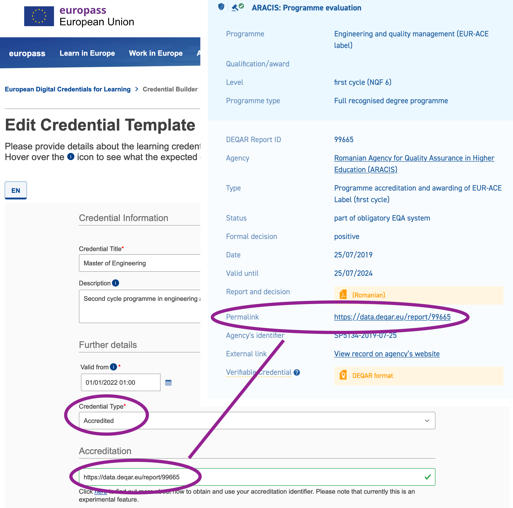

# European Digital Credentials for Learning

European Digital Credentials for Learning are a standard for issuing education credentials (e.g. diplomas, transcripts of records, etc.) in a tamper-proof digital format, with authentication and verification checks built in. The standard was developed and is maintained by the European Union.

DEQAR data is automatically loaded into the Europass Qualifications Dataset Register (QDR) and then feeds the Accreditation Database against which European Digital Credentials are verified.

**If your external quality assurance (whether at institutional or programme level) is recorded in DEQAR, you can immediately issue EDC credentials that are classified as "accredited".**

## Reports exported

Given the relevant EDC policies and requirements, reports are exported from DEQAR if the following conditions are met:

 1. At least one higher education institution covered has its legal seat in an **EU/EEA member country that has a qualifications framework (NQF) referenced to European Qualifications Framework for Lifelong Learning (EQF)**.

    > *Why: European Digital Credentials can be issued by HEIs established in the EU+EEA only (because of the eIDAS regulation); the EU only accepts data in the QDR for countries with a NQF referenced to the EQF.*

 2. Status is "**part of obligatory EQA system**".

    > *Why: for a credential to be considered "accredited" under EDC policies it is required that the programme or institution have been subject to an official external quality assurance process in line with the national requirements of the country.*

 3. Report has **no high-level flags**.

    > *Why: a high-level (red) flag indicates that a report might have been wrongly classified or the agency's official status in a country still needs to be verified by EQAR staff.*

## Use in practice

The European Commission provides a [step-by-step guide how to issue European Digital Credentials for Learning](https://europa.eu/europass/en/how-issue-european-digital-credentials). Please consult that step-by-step guide first, the following steps only cover the aspect of accreditation.

 1. **Look up the DEQAR Permalink**

    You will need the DEQAR Permalink of the external quality assurance that covers the credential you want to issue, e.g. a programme accreditation of that specific programme or an institutional accreditation that is/was valid when the degree was awarded.

    Find your institution in DEQAR and then look up the relevant institutional or programme-level external quality assurance report from the list.

 2. **Enter credential data**

    When you create a model credential in the web-based [EDCI Issuer](https://europa.eu/europass/digital-credentials/issuer/#/credential-builder), you can use the DEQAR Permalink directly as Accreditation identifier as shown in the screenshot. Please also make sure to define the credential type as "Accredited".

    

    If the identifier cannot be found (field turns red instead of green), please check if all the above requirements are met for the external quality assurance report you are trying to use.

 3. **Issue digital credential**

    You can now issue a (test) credential using your external quality assurance from DEQAR as accreditation in EDC; see the [step-by-step guide](https://europa.eu/europass/en/how-issue-european-digital-credentials) for details.

 4. **Verify credential**

    Finally, you can double-check that your (test) credential is correctly verified and cleared as "accredited" in the [EDCI Viewer](https://europa.eu/europass/digital-credentials/viewer/#/home).

## Questions or comments

Please note that accreditation is still an experimental feature in EDC. If you have questions or encounter any issues, please contact the European Commission's helpdesk at <EMPL-ELM-SUPPORT@ec.europa.eu> or the EQAR Secretariat at <deqar@eqar.eu>.

