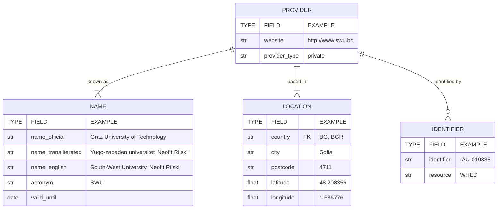

# Provider Data

Each report must be associated with at least one higher education provider. If a record already exists in DEQAR, the provider needs to be identified; otherwise, the provider must be created **before** a report can be submitted.

## Providers in DEQAR

DEQAR distinguishes two types of providers - higher education institutions and other providers. DEQAR only registers providers which provide learning opportunities at the QF-EHEA Levels (equivalent to EQF and ISCED levels 5 to 8). Vocational education and training provisions at EHEA QF level 5 which are not considered as higher education in the national systems are not included.

The main difference between the two types of providers is whether the entity has full degree awarding powers or not. The number of programmes for which the provider has awarding powers, the subject area and the mode of delivery of the programme are not important for the differentiation.

|   | Higher education institution | Other provider           |
|:--|:-----------------------------|:-------------------------------|
| QF-EHEA short to PhD/EQF Levels 5-8 | Yes | Yes |
| Short programmes (&lt;60 ECTS) | Yes, optionally | Yes |
| Programmes leading to full degree (short, bachelor, master, PhD degree) | Yes | No |
| Programmes leading to other types of certificates (e.g. nano or micro degree, badges etc.) | Yes | Yes |

Agencies are advised to consult with the EQAR Secretariat at deqar@eqar.eu in case they are in doubt about the nature of the provider. Should this be the case, agencies are encouraged to share materials on the provider, and any other evidence that could help EQAR in concluding the status.

## Finding Existing Providers

Existing providers need to be identified by their DEQARINST ID, ETER ID (for higher education institutions), another international identifier, or a local or national identifier (if available).

DEQAR has records on a large number of higher education institutions (over 4000 institutions from 42 European countries) harvested from the ETER/OrgReg databases (available through [Research infrastructure for research and innovation policy studies - RISIS](http://datasets.risis.eu/) or [European Tertiary Education Register - ETER](https://www.eter-project.com/)). More than 2000 additional providers are already recorded in DEQAR based on other official sources (e.g. lists by national ministries) or have been added by other agencies.

### Admin Interface

All [provider identifiers](architecture_data_model.md#provider-identifiers) can be found through the [administrative interface](https://admin.deqar.eu/reference/institutions).

> **Important:** The public [DEQAR website](https://www.deqar.eu/) does *not* show all providers, but only those for which at least one report is available. It is therefore important that you **always search for providers in the [administrative interface](https://admin.deqar.eu/reference/institutions)**, as DEQAR contains records on several hundreds of higher education institutions and a few other providers for which no reports have been submitted yet.

Reports on existing providers can be submitted directly, providing identifiers in CSV or JSON objects as described under [Submission Object Data Elements: Institution(s)](report_data.md#institutions) or by selecting the provider in the web form.

### Download CSV File

The full list of providers can also be downloaded as a CSV file from:

<https://www.eqar.eu/qa-results/download-data-sets/>

### Connect API

The full providers list can be searched and accessed using the Connect API. EQAR-registered agencies have access to the Connect API using the same credentials as for the DEQAR administrative interface, the Submission API and the Web API.

Please refer to the [explanations on authentication for the Submission API](data_submission.md#authentication) for information on how to obtain and use a token.

The base URL for the Connect API is:

`https://backend.deqar.eu/connectapi/v1`

The endpoint <https://backend.deqar.eu/connectapi/v1/institutions/> allows to query the full list of higher education institutions, with or without reports.

The endpoint <https://backend.deqar.eu/connectapi/v1/providers/> allows to query the full list of all providers, with or without reports. The list can be filtered by type of provider, i.e. higher education institutions and other providers.

The full definitions of the endpoints, the search parameters and the response object are available as [OpenAPI Specification 3.0](https://en.wikipedia.org/wiki/OpenAPI_Specification) at:

<https://backend.deqar.eu/connectapi/v1/swagger/>

To retrieve the details on a single provider, please use the [Web API endpoint](web_api_endpoints.md#institutions).

## Defining Higher Education Institutions

Before suggesting to add a new higher education institution, please consider the following notes:

 1. DEQAR mainly follows European Tertiary Education Register's (ETER) [data model and coverage](https://eter-project.com/#/info/coverage).

 2. The primary unit of registration is the university/higher education institution, i.e. an institution of higher learning that awards full recognised academic degrees in diverse disciplines, is organised as central unit and consists of separate functional units (i.e. faculties, institutes, schools, departments). The degree-awarding powers of the institution are recognised by at least one national authority.

 3. Functional units (i.e. faculties, institutes, schools, departments) themselves are not registered in DEQAR as separate entities. Reports on functional units are uploaded/recorded/shown under the central unit's record.

 4. Reports on consortia consisting of several providers will be showcased in the record of each provider separately. Consortia themselves will not be presented as a central unit.

    Only in exceptional cases, when the consortium has a long-term tradition of organising education and is recognised by stakeholders as an institution itself, will it be registered as a separate institution in DEQAR; such cases are to be discussed with the EQAR Secretariat in advance.

 5. Reports on institutions' branches and campuses, home and abroad, will be showcased in the record of the central institution (i.e. the university), while such additional branches/campuses will be shown as further locations of the institution. Only in exceptional cases, where the branch/campus has a proven long-term tradition of organising education and is recognised by stakeholders as a semi-independent institution, will it be registered in DEQAR.

 5. Providers that award full recognised degrees through a franchise or validation partnership with a higher education institution, but have no own degree-awarding power, will be recorded as other provider. A hierarchical relationship to the partner higher education institution should be recorded for transparency.

 6. In cases when the status of the entity is not clearly determined by the aforementioned cases or the status is debatable, EQAR and the agency will discuss the nature of it taking into account five main indicators:

    - legal status
    - provideral independence
    - financial independence
    - stakeholders’ perceptions
    - local context and approaches to higher education

## Defining Other Providers

In DEQAR, "other provider" is a provider that delivers content or provides skills training:

 1. At higher education level (i.e. EHEA QF level 5 to 8; EQF 5 to 8; EHEA cycle short to third)

 2. Does not have a full degree awarding powers (i.e. right to award bachelor, master or PhD degrees)

The mode of delivery of the classes, whether the provision is done independently or in partnership with a higher education institution, the ownership of the provider (e.g. private or public provider), the connection to the labour market and the area of study are not defining elements of "other providers" in DEQAR.  

Reports for programmes offered in collaboration by a higher education institution and another provider will be showcased under both entities respectively.

Similarly, a provider that offers education programmes under a franchise or validation agreement with a higher education institution would be considered as "other provider", whereas the franchise/validation partnership would be reflected as a linkage with the HEI concerned.

## Provider Data Elements

If a record for a **provider does not already exist in DEQAR** it should be described with the elements below; required elements are marked in bold or by a **\***. Before a new record is created, data will be checked against provider data already in DEQAR. If a DEQAR provider record is identified as a match, the existing record will take precedence over submitted data.

|ELEMENT NAME |REQUIRED FOR HEIs IN OrgReg |REQUIRED FOR HEIs NOT IN OrgReg |REQUIRED FOR OPs |ONE/MANY |EXAMPLE |
|:------------|:---------------------------|:-------------------------------|:----------------|:--------|:-------|
|**Official Name** |yes |yes |yes |one |*Graz University of Technology* *Югозападен университет "Неофит Рилски"* *Πληροφορίες για τους αλλοδαπούς φοιτητές: Είσοδος και προγράμματα*|
|Official Name, transliterated |no |no |no |one |*Yugo-zapaden universitet "Neofit Rilski”* *Plirophoríes yia tous allodapoús phitités: Ísodos kai prográmmata*|
|English Name |no |no |no |one |*South-West University "Neofit Rilski", Blagoevgrad*|
|Acronym |no |no |no |one |*SWU* |
|**Location Country** |yes |yes |yes |many |*BG* *BGR* |
|**Location City** |yes |yes |yes |many |*Sofia* |
|**Location Postcode** |yes |no |no |many |*Sofia* |
|Location Latitude & Longitude|no |no |no |many |*48.208356; 1.636776* |
|**Website** |yes |yes |yes |one |*http://www.swu.bg* |
|**Other Identifier** |no |yes |yes |many |*IAU-019335* |
|Identifier Resource |no |yes |yes |many |*WHED* |
|Identifier Source |no |yes (conditionally)|yes (conditionally) |many |*National register of learning providers in the UK, see https://www.ukrlp.co.uk/* |
|Proof of Status |n/a |yes (conditionally)|n/a |one |*https://www.gov.si/teme/evs-evidenca-visokosolskih-zavodov-in-studijskih-programov/* |
|Type of Provider |n/a |n/a |no |one |*private* |
|Qualification Level |no |no |yes |many |*0 - short cycle* *1 - first cycle* *2 - second cycle* *3 - third cycle*|

### Name(s)

Exactly one official provider name must be provided for each new provider record. Each official name that is in a non-Latin script should be accompanied by a transliterated version to support search and discovery. An English provider name should be provided for each new provider record. If provided, the English name will be used for display. A provider acronym may also be provided. (Note: alternative or other language names can be provided through the administrative interface.)

* **Official Name\*** (<code>name_official</code>; required; string)  
  The official name of each provider in the original alphabet must be provided for every new provider record. The official name will be indexed for search and may be used as the primary provider name in the search interface if no English institution name is assigned.

    *e.g. Graz University of Technology*  
    *e.g. Югозападен университет "Неофит Рилски"*  
    *e.g. Πληροφορίες για τους αλλοδαπούς φοιτητές: Είσοδος και προγράμματα*

* Official Name, transliterated (<code>name_official_transliterated</code>; not required; string)  
  A romanised transliteration should be provided if the official provider name is in non-Latin script. If no romanised form is stored locally, then [ISO romanisation standards](https://en.wikipedia.org/wiki/List_of_ISO_romanizations) can be used to created romanised forms. If transliteration is not provided, access to the provider record through the search interface will be more limited. For those languages included in the [Python transliterate package](https://pypi.org/project/transliterate/) transliterations can be generated automatically when [supplying provider data in bulk](#bulk-upload).

    *e.g. Yugo-zapaden universitet "Neofit Rilski”*  
    *e.g. Plirophoríes yia tous allodapoús phitités: Ísodos kai prográmmata*

* English Name (<code>name_english</code>; recommended; string)  
  A single English provider name should be provided for any provider without an English official name. If provided, the English name will be used as the primary name for display in the DEQAR interface; the search, however, always matches against all name versions/variations. While not required, providing an English name is strongly recommended to enhance the user experience.

    *e.g. South-West University "Neofit Rilski", Blagoevgrad*

* Provider Acronym (<code>acronym</code>; not required; string)  
  The official acronym for each provider may be provided. This will be indexed for search. It should thus be provided especially where it is commonly used to refer to the institution, so that it can be found more easily.

    *e.g. SWU*  
    *e.g. BOKU*

### Location

One or more locations must be provided for each new provider record. A location is provided as a combination of a country and a city name along with an optional latitude and longitude.

Each provider must have one and only one location designated as main legal seat.

For higher education institutions, the legal seat is considered as the higher education system in which the institution is formally recognised. In case an institution is a legal entity incorporated in country A but formally recognised as higher education institution in system B, the legal seat should be specified in B. In case a higher education institution is formally recognised in several higher education systems, separate provider records should be created, one for each system.

For other providers, the legal seat is considered as the country in which the legal entity is incorporated.

For providers with multiple seats (e.g. branches), each of the locations (i.e. country and city) could be provided in a separate column with number in the brackets (`[n]`).

The first country (i.e. country_id) will be considered as the main legal seat of the provider.

* **Provider Legal Seat Country\*** (<code>country_id</code>; required; string)  
  The country where each provider has its legal seat (see above) must be provided for every new provider record.

    Each country must be provided using either an ISO 3166 alpha2 or ISO 3166 alpha3 country code (see [ISO 3166-1 standard](https://en.wikipedia.org/wiki/ISO_3166-1)), or using the DEQAR numerical ID. Provider countries will be indexed for search.

    *e.g. BG*  
    *e.g. BGR*

* **Provider Legal Seat City\*** (<code>city</code>; required; string)  
  The city name, preferably in English, where the provider has its legal seat may be provided for each provider  record. If a provider is located in more than one city, further cities can be provided as other locations (see below).

    *e.g. Sofia*

* **Provider Legal Seat Postcode\*** (<code>postcode</code>; conditionally required; string)  
  The postcode of the provider's legal seat.

    This field is required for higher education institution in systems covered by OrgReg/ETER.

    e.g. 1030

* Provider Legal Seat Latitude (<code>latitude</code>; not required; float)  
  Provider Legal Seat Longitude (<code>longitude</code>; not required; float)  
  The exact latitude and longitude of the organisation site or the general latitude and longitude of the city may also be provided for each provider record.

    *e.g. 48,208,356; 1,636,776*

If the provider has further locations in the same or other countries, the agency may provide further information. In the CSV file, each additional location should be presented in a new column with the subsequent number in brackets (i.e. `[n+1]`).

The following set of columns can be copied for each additional location:

* Other Location Country (<code>other_location[n].country</code>; not required; string)  

* Other Location City (<code>other_location[n].city</code>; not required; string)  

* Other Location Postcode (<code>other_location[n].postcode</code>; conditionally required; string)  

* Other Location Latitude (<code>other_location[n].latitude</code>; not required; float)  
  Other Location Longitude (<code>other_location[n].longitude</code>; not required; float)

    The format and requirements are identical to the corresponding fields above.

### Qualification Level

The provider QF-EHEA levels **may** be provided for higher education institutions and **must** be provided for other providers.

* Provider Qualification Level (<code>qf_ehea_level[n]</code>; conditionally required; string)  
  One or more qualification levels may be provided for higher education institutions and must be provided for other providers as either a DEQAR level name or a DEQAR level id. DEQAR uses levels based on three main frameworks/classifications:
    - [Framework for Qualifications of the European Higher Education Area](https://www.ehea.info/page-qualification-frameworks) (QF EHEA level),
    - [European Qualification Framework](https://europa.eu/europass/en/europass-tools/european-qualifications-framework) (EQF) and
    - [International Standard Classification of Education](https://uis.unesco.org/en/topic/international-standard-classification-education-isced) (ISCED).

    These are the qualification framework levels at which each higher education institution may award degrees or offer programmes (for other providers). Note: if QF levels are provided, then *all* levels covered by the provider should be provided at the same time.

    In the CSV template, each level can be presented as ONE of the possible numbers OR words. Each additional level should be presented in a new column with the subsequent number in brackets (i.e. `[n+1]`).

    |ID (QF-EHEA level) |ID (EQF level, ISCED level) |name (QF-EHEA level) |
    |:--|:--|:-----------|
    |0  |5  |short cycle |
    |1  |6  |first cycle |
    |2  |7  |second cycle|
    |3  |8  |third cycle |

### Website

Exactly one website link must be provided for each new provider record.

* **Provider Website (\*)** (<code>website_link</code>; required; string)  
  The URL to the primary provider website or home page. The root domain name of the site should be used when possible, without language or other qualifiers.

    *e.g. http://www.swu.bg*  
    *e.g. https://qualifications.pearson.com/*

### Identifier

Providing an identifier serves as proof of confirming the validity of the provider and aiding the users to find providers easily in other databases. The identifier can be used later to identify this provider in the report submission objects.

> A local identifier may be provided for the providers. Local identifiers are for use by your agency only, whereas other identifiers can be used also by others.
> 
> Other identifiers may be provided for higher education institutions in OrgReg and must be provided for higher education institutions which are not in OrgReg and for all other providers.
>
> For higher education institutions, it is **strongly recommended** to provide the institution's identifier in the [IAU/UNESCO World Higher Education Database (WHED)](https://www.whed.net/).
>
> Institutions listed in WHED are confirmed to be nationally-recognised higher education institutions. If a WHED identifier is provided the institution is thus accepted automatically.

> **If no WHED identifier is provided, additional proof of the institution's official status is required**, see below.
>
> EQAR runs a background list of other trusted identifiers presented below.
>
> For other providers based in the European Union, agencies are expected to submit the EU - VAT number as identifier.

* Provider Identifier (<code>identifier</code>; conditionally required; string)  
  Please note that identifiers must be unique within your agency or within the resource provided.

    *e.g. HCERES21*

* Identifier Resource (<code>identifier_resource</code>; conditionally required; string)  
  If the identifier is not a local identifier of your agency, you must provide a short label designating the resource in order to distinguish it from other identifiers. As the resource tag needs to be used consistently, and the combination of identifier and resource tag needs to be globally unique in DEQAR, it should be communicated with the EQAR secretariat.

    *e.g. DE-HRK*

* Identifier Source (<code>identifier_source</code>; conditionally required; string)  
  The agency must provide other identifiers for higher education institutions which are not in OrgReg and for all other providers. The field must be filled in if the identifier is not yet known to EQAR (see table below for trusted identifiers). The source can be a national authority, an international provider or another entity.

    If the identifier is already known to EQAR (see table), there is no need to fill this field.

    *e.g. World Higher Education Database*

* Proof of Status (<code>proof_of_status</code>; conditionally required; string)  
  If the higher education institution is not listed in WHED, or the agency does not provide the WHED identifier, an official source must be provided to proof that the institution indeed has full degree awarding powers in at least one higher education system.

    The source could be the website of the ministry responsible for higher education, an official national register of higher education institutions or similar. Please note that a link to the **institution's own website is not accepted as official source**.

    *e.g. https://www.gov.si/teme/evs-evidenca-visokosolskih-zavodov-in-studijskih-programov/*

The following common European or international identifier types are known in DEQAR and can be used without additional information, i.e. it is sufficient to provide the identifier resource, the identifier source does not need to be specified.

| Identifier resource | Title  | Source |
|:--------------------|:-------|:------------|
| DID-EBSI | DID for the European Blockchain Service Infrastructure (EBSI) | Decentralised Identifier (DID) that enables verifiable, decentralised digital identity within the EBSI ecosystem - data provided by higher education institutions participating in EBSI, see <https://ec.europa.eu/digital-building-blocks/wikis/display/EBSIDOC/EBSI+DID+Method> |
| Erasmus | Erasmus Institution Code | Identifier assigned by the European Commission to higher education institutions participating in the Erasmus+ programme - data harvested from ETER/OrgReg, see <https://erasmus-plus.ec.europa.eu/resources-and-tools/erasmus-charter-for-higher-education> |
| Erasmus-Charter | Erasmus Charter for Higher Education (ECHE) | Application number related to the ECHE, required for higher education institutions participating in the Erasmus+ programme - data acquired using the European University Foundation (EUF) HEI API, see <https://erasmus-plus.ec.europa.eu/resources-and-tools/erasmus-charter-for-higher-education> |
| EU-PIC | Participant Identification Code (PIC) | A PIC is assigned to legal entities participating in EU-funded programmes - data acquired using the European University Foundation (EUF) HEI API, see <https://ec.europa.eu/info/funding-tenders/opportunities/portal/screen/how-to-participate/participant-register> |
| EU-VAT | EU VAT number | Identifier of economic operators for value-added tax (VAT) within the EU system, assigned by their national authority - data acquired using the EU participant register API, see <https://ec.europa.eu/taxation_customs/vies/#/vat-validation> |
| SCHAC | SCHema for Academia | Internet domain (DNS)-based identifier of institutions, used in several European initiatives for data exchange in the education and research sector, e.g. Emrex - data acquired using the European University Foundation (EUF) HEI API, see <https://wiki.refeds.org/display/STAN/SCHAC> |
| WHED | IAU World Higher Education Database (WHED) | Identifier used in the world-wide WHED database of higher education institutions, managed by the International Association of Universities (IAU) - data harvested from ETER/OrgReg, see <https://www.whed.net/> |

The following table contains some examples of national identifiers already known in DEQAR:

| Identifier resource | Source | Further information |
|:--------------------|:-------|:------------|
| FR-SIREN | The National Institute of Statistics and Economic Studies of France | <https://sirene.fr/sirene/public/accueil> |
| UK-PIN | The UK Register of Learning Providers | <https://www.ukrlp.co.uk/> |
| KZ-BIN | Ministry of Finance of the Republic of Kazakhstan | <https://kgd.gov.kz/en/services/taxpayer_search> |

### Dates

Founding and closing years or dates should be provided if known.

* Founding date (<code>founding_date</code>; not required; date)  
  Closing date (<code>closing_date</code>; conditionally required; date)  
  Dates should be formatted as *YYYY-MM-DD* and years should be given in four digits (*YYYY*).

    The closing date must be provided if the provider has closed its operation.

    *e.g. 2020-07-01*

### Hierarchical Relationship

* Parent Provider (<code>parent_id</code>; not required; string)  
  The parent can be specified by its DEQARINST ID, optionally in numerical form without the prefix *DEQARINST*.

    For higher education institutions: if the institution is a faculty or independent unit of another institution, or is part of a grouping of institutions that is also recorded in DEQAR, ETER or OrgReg, you must specify the parent institution.

    In case the parent institution is not in DEQAR or ETER/OrgReg, a request for adding the parent institution must be submitted too.

    For other providers: if the provider is part of another provider that offers courses at higher education level, is part of a higher education institution, or is part of a grouping of providers that is also recorded in DEQAR the parent provider should be specified.

    If the parent provider is not recorded in DEQAR yet, a request for adding that provider must be submitted too. Please note that for DEQAR it is not relevant if the provider is part of a larger grouping that does work in fields other than higher education provision. Such relationships will not be recorded in DEQAR.

    *e.g. DEQARINST4711*

* Relationship Type (<code>parent_type</code>; conditionally required; string)  
  If a parent provider is specified, the type of hierarchical relationship must be classified as one of the following types:

    |ID |Type |Remarks |
    |:--|:----|:-------|
    |1  |consortium |default type for multi-level institutions or consortia |
    |2  |faculty |faculty names always appear together with their parent university's name (NB: exceptional case, faculties are normally not recorded) |
    |3  |independent faculty or school |used if a faculty or department is recorded separately and should appear under its own name only |
    |5  |franchise or validation partnership |used if a provider offers education leading to a degree/award by another higher education institution |

    *e.g. faculty*

### Type of Other Provider

* Type of Other Provider (<code>type_provider</code>; not required; string)  
  Information of relevance only for other providers. The nature of the provider should be marked if known.

    Four main categories are defined:

    |ID |name |
    |:--|:-------|
    |1  |private company|
    |2  |non governmental provider|
    |3  |public – private partnership|
    |4  |public provider|
    |5  |other|

### Data Source

* Agency providing information on the provider (<code>agency_id</code>; recommended; string)  
  The agency that provides the information should provide its DEQAR ID. The ID can be consulted in the admin interface.

    *e.g. 1*  
    *e.g. 73*

* Source of information on the provider (<code>source_information</code>; recommended; string)  
  Link to databases where more information on the organization could be found.

    *e.g. World Higher*

## How to Provide Data

If you identify that providers are missing, please send us a spreadsheet with the required data.

Before sending data on a new providers, please check carefully that the providers is not yet listed in the [reference list of providers](https://admin.deqar.eu/reference/institutions). It is important to use the administrative interface to do so, as there are many institutions and few providers  recorded in DEQAR for which no reports have been uploaded yet. These are visible in the administrative interface, but not in the public interface; see also the section [Finding Existing Providers](#finding-existing-providers) above.

Please supply the providers data using the right template depending on the type of provider:

* For higher education institutions:
     - [Open Document Format](files/Template_HEI_lists.ods) (LibreOffice, OpenOffice)
     - [Microsoft Excel format](files/Template_HEI_lists.xlsx)
* For other providers:
     - [Open Document Format](files/Template_OP_lists.ods) (LibreOffice, OpenOffice)
     - [Microsoft Excel format](files/Template_OP_lists.xlsx)

You may save the spreadsheet in either format or as a CSV file. Send the filled spreadsheet to [deqar@eqar.eu](mailto:deqar@eqar.eu); the EQAR Secretariat will check the list shortly and return the original file with the newly generated DEQARINST IDs added.

